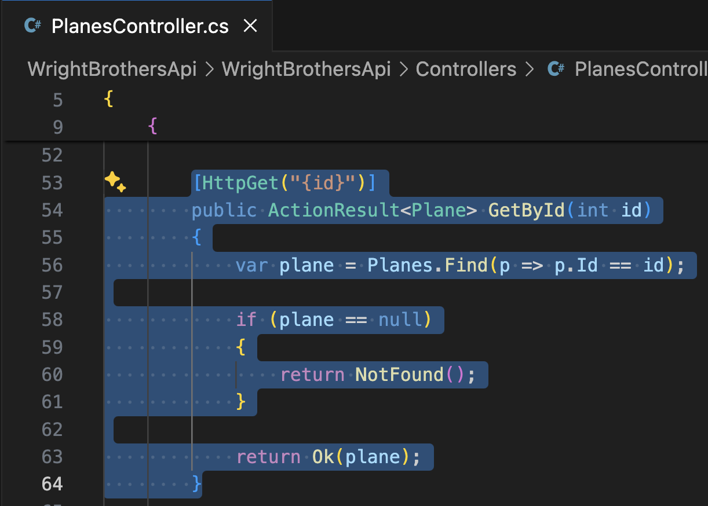
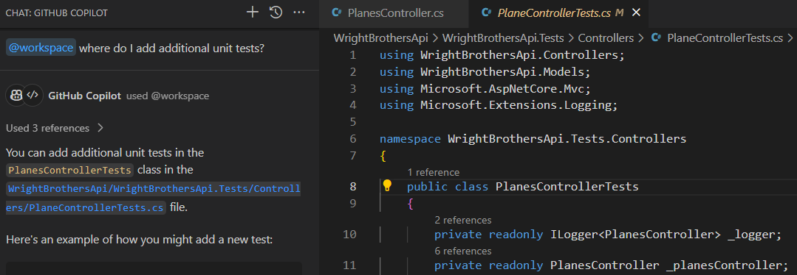
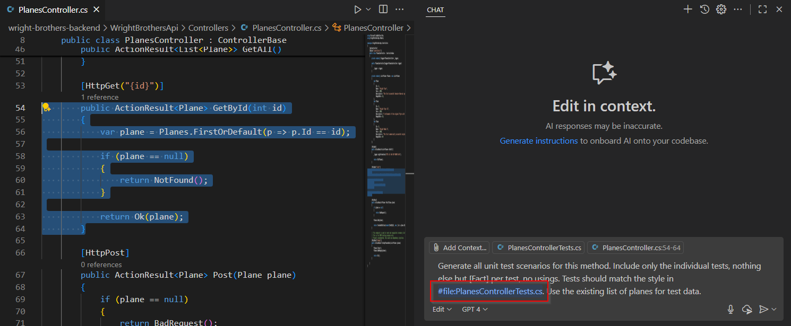
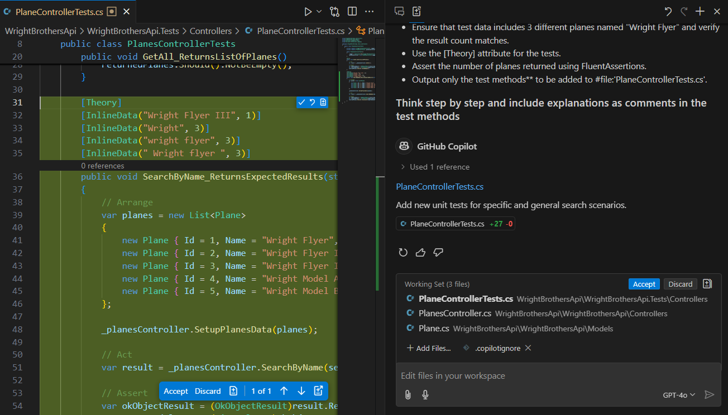

# Lab 2.2 - Taking Off with Code: Clearing the Runway

This lab exercise guides participants through coding exercises using GitHub Copilot to understand its suggestions and capabilities. It involves running and adding unit tests, with an emphasis on pair programming. The lab is structured in steps, starting with executing existing unit tests, followed by enhancing test coverage, and addressing specific functionalities like case sensitivity and trimming in search methods.

## Prerequisites
- The prerequisites steps must be completed, see [Labs Prerequisites](../Lab%201.1%20-%20Pre-Flight%20Checklist/README.md)

## Estimated time to complete

- 20 minutes.

## Objectives

- Simple coding exercises using GitHub Copilot, focusing on understanding its suggestions and capabilities.
- Pair programming: One 'pilot' codes, the other guides using Copilot's suggestions.

    - Step 1 - Taxying to the Runway - Run existing unit tests
    - Step 2 - Pre-takeoff Pilot Checks - Completing Unit Tests
    - Step 3 - Takeoff - Adding Unit Tests for Case Sensitivity
    - Step 4 - Understanding and Adding Model Validation
    - Step 5 - Generating Positive and Negative Unit Tests
    - Step 6 - Validating and Running Tests

### Step 1: Taxying to the Runway - Run existing unit tests

- Open GitHub Copilot Chat, click `+` to clear prompt history.

- Type the following in the chat window:

    ```sh
    @workspace how do I run the unit tests?
    ```

- Copilot will give a suggestion to run the unit tests in the terminal.

    ```sh
    dotnet test WrightBrothersApi/WrightBrothersApi.Tests/WrightBrothersApi.Tests.csproj
    ```

- Let's run the unit tests in the terminal to make sure everything is working as expected.

- From the Copilot Chat window, select one of the two options:

  1. Click the ellipses, `...`, select `Insert into Terminal`.

  1. If there isn't a terminal open, click the `Open in Terminal` button.

  1. Click copy button, then, open a new Terminal window by pressing **Ctrl+`** (Control and backtick), paste into Terminal window.

- Open the terminal and run the tests with the provided command.

    ```sh
    dotnet test WrightBrothersApi/WrightBrothersApi.Tests/WrightBrothersApi.Tests.csproj
    ```

> [!NOTE]
> If you get an error resembling this: `MSBUILD : error MSB1009: Project file does not exist.`, then you are most likely running this command from the wrong folder. Change into the correct directory with `cd ./WrightBrothersApi` or with `cd ..` to go one folder level upwards.

- The tests should run and many will pass.

    ```sh
    Starting test execution, please wait...
    A total of 1 test files matched the specified pattern.
    Test summary: total: 1, failed: 0, succeeded: 1, skipped: 0
    ```

### Step 2: Pre-takeoff Pilot Checks - Completing Unit Tests

- Open GitHub Copilot Chat, click `+` to clear prompt history.

- Type the following in the chat window:

    ```sh
    @workspace where do I add additional unit tests?
    ```

- Copilot will give a suggestion to add unit tests to the `Controllers/PlanesControllerTests.cs` file in the `WrightBrothersApi.Tests` project.

- You can add additional unit tests in the `PlanesControllerTests` class in the `WrightBrothersApi.Tests/Controllers/PlanesControllerTests.cs` file.

- Open the `PlaneController.cs` file.

- Select all the code for the `GetById` method.



- Next, open Copilot Chat and Copy/Paste the following

    ```md
    Generate all unit test scenarios for this method. Include only the individual tests, no usings.
    ```




- Press `Enter`, GitHub Copilot will automatically suggest the `[Test]` attributes.


- The problem is that the generated test methods do not match with the style of the existing test methods in the `PlanesControllerTests.cs` file.

- Let's fix this. Open Copilot Chat and Copy/Paste the following and place your cursor after `tests should match `:

    ```md
    Generate all unit test scenarios for this method. Include only the individual tests, nothing else but [Fact] per test, no usings. Tests should match the style in #file:PlanesControllerTests.cs . Use the existing list of planes for test data.
    ```

> [!NOTE]
> When copy/pasting the `#file:PlanesControllerTests.cs`, it will not work. You will need to select the file again from the pop-up window, like in the previous step.

- First remove `#file:PlanesControllerTests.cs` and keep your cursor at the same position.

- Next, type `#file` in the chat window and press Enter.



- A pop-up will appear where you can search for files.

- Select the file `PlanesControllerTests.cs` and press Enter.

> [!NOTE]
> With `#file` you can easily add a file to the Copilot Context. If you already know the filename, you can simply type #PlanesControllerTests.cs and avoid using the pop-up file selector.

> [!IMPORTANT]
> `#file` will not work with copy/pasting `#file:PlanesControllerTests.cs`. You need to select it from the pop-up window.

- Now submit the prompt by pressing Enter.

- Copilot will give a suggestion to generate all unit test scenarios for the `GetById` method.

<Br>

<details>
<summary>Click for Solution</summary>

```csharp
[Fact]
public void GetById_ExistingId_ReturnsPlane()
{
    // Arrange
    var id = 1; // assuming a plane with this id exists

    // Act
    var result = _planesController.GetById(id);

    // Assert
    var okObjectResult = (OkObjectResult)result.Result!;
    var returnedPlane = (Plane)okObjectResult.Value!;
    returnedPlane.Should().NotBeNull();
    returnedPlane.Id.Should().Be(id);
}

[Fact]
public void GetById_NonExistingId_ReturnsNotFound()
{
    // Arrange
    var id = 999; // assuming no plane with this id exists

    // Act
    var result = _planesController.GetById(id);

    // Assert
    result.Result.Should().BeOfType<NotFoundResult>();
}
```
</details>

<Br>

> [!NOTE]
> Copilot generated two unit tests for the `GetById` method. The first test checks if the method returns a plane when the id exists. The second test checks if the method returns a `NotFound` result when the id does not exist. It also matches how the unit tests are structured in the `PlanesControllerTests.cs` file.

> [!NOTE]
> Creating unit tests works best when the scope is limited to a single method. You can then use `#file` to make sure it creates unit tests that is in line with the existing unit tests.

- Now Open `PlanesControllerTests.cs` and Place your cursor at the end of the file, after the `}` of the `GetAll_ReturnsListOfPlanes()` method.

```csharp
public class PlanesControllerTests
{
    [Fact]
    public void GetAll_ReturnsListOfPlanes()
    {
        // method body
    }

    <---- Place your cursor here
}
```

- In GitHub Copilot Chat, click the ellipses `...` and select `Insert at cursor` for the suggested unit test methods.

- Let's test the newly added tests by opening the terminal and run the tests with the provided command.

    ```sh
    dotnet test WrightBrothersApi/WrightBrothersApi.Tests/WrightBrothersApi.Tests.csproj
    ```

> [!NOTE]
> Some tests might still fail. Copilot does not always provide the correct suggestions. It's important to understand the suggestions and do some extra work to make sure the tests are correct. Copilot can help you with that as well.

- The tests should run and many will pass.

    ```sh
    Starting test execution, please wait...
    A total of 1 test files matched the specified pattern.
    Test summary: total: 3, failed: 0, succeeded: 3, skipped: 0
    ```

### Step 3: Taking Off - Developing Robust Tests

- Open the `/WrightBrothersApi/Controllers/PlanesController.cs` file.

- Make sure to have the `SetupPlanesData()` and `SearchByName()` method to the `PlanesController.cs` file if you haven't already in the previous lab. If not, use the following code snippet to add the method at bottom of the file.

    ```csharp
    [HttpPost("setup")]
    public ActionResult SetupPlanesData(List<Plane> planes)
    {
        Planes.Clear();
        Planes.AddRange(planes);

        return Ok();
    }

    [HttpGet("search")]
    public ActionResult<List<Plane>> SearchByName([FromQuery] string name)
    {
        var planes = Planes.FindAll(p => p.Name.Contains(name));

        if (planes == null)
        {
            return NotFound();
        }

        return Ok(planes);
    }
    ```

> [!NOTE]
> Setting up data like this is not recommended in a production environment. It's better to use a database or a mock database for this purpose. For the sake of this lab, we are using this approach.

- In the following exercise you will combine everything you learned in the previous steps, but then for the `SearchByName` method. The following prompt is a more detailed description of a problem and the expected solution. You will prompt GitHub Copilot to make it use a `#selection`. besides that you will use `#file` two times in the prompt to make sure Copilot knows the context of the problem.

- Open `GitHub Copilot Edits`, then click `+` for `New Edit Session`.

- Add the following files to the `Working Set` near the bottom of Copilot Edits window.

- Click the `+ Add files` button, then select these:
    - `PlanesControllerTests.cs`
    - `PlanesController.cs`
    - `Plane.cs`

> [!NOTE]
> You can multiple select these files from the file explorer by holding the `Ctrl` down and clicking on each file. Then simply drag-n-drop them into the `Edit with Copilot` window.

- Copy/Paste the following in the Copilot Edits Chat window:

    ```md
    # Generate new unit tests for the following scenarios:
    - Specific search for "Wright Flyer III"
    - General search for "Wright"
    - Case-insensitive search for "wright flyer"
    - Search with extra spaces for " Wright flyer "

    # Technical Details
    - Use the existing methods SetupPlanesData and SearchByName in #file:'PlanesController.cs'.
    - Create 5 planes based on the Wright Brothers in #file:'Plane.cs' for the test scenarios. Populate this data using SetupPlanesData.
    - Ensure that test data includes 3 different planes named "Wright Flyer" and verify the result count matches.
    - Use the [Theory] attribute for the tests.
    - Assert the number of planes returned using FluentAssertions.
    - Output only the test methods** to be added to #file:'PlanesControllerTests.cs'.
    - Include explanations as comments in the test methods.
    ```



- Submit the prompt by pressing Enter.

- Copilot will generate unit tests for the `SearchByName` method add them to the `Plane

<Br>

<details>
<summary>Click for Solution</summary>

    ```csharp
    [Theory]
    [InlineData("Wright Flyer III", 1)]
    [InlineData("Wright", 5)]
    [InlineData("wright flyer", 3)]
    [InlineData(" Wright flyer ", 3)]
    public void SearchByName_ReturnsExpectedPlanes(string searchTerm, int expectedCount)
    {
        // Arrange
        var planes = new List<Plane>
        {
            new Plane { Id = 1, Name = "Wright Flyer I", Year = 1903, Description = "First powered flight", RangeInKm = 37 },
            new Plane { Id = 2, Name = "Wright Flyer II", Year = 1904, Description = "Improved design", RangeInKm = 61 },
            new Plane { Id = 3, Name = "Wright Flyer III", Year = 1905, Description = "First practical plane", RangeInKm = 39 },
            new Plane { Id = 4, Name = "Wright Model A", Year = 1906, Description = "First production plane", RangeInKm = 100 },
            new Plane { Id = 5, Name = "Wright Model B", Year = 1910, Description = "Improved Model A", RangeInKm = 120 }
        };
        _planesController.SetupPlanesData(planes);

        // Act
        var result = _planesController.SearchByName(searchTerm);

        // Assert
        result.Result.Should().BeOfType<OkObjectResult>();
        var okObjectResult = (OkObjectResult)result.Result;
        var returnedPlanes = (List<Plane>)okObjectResult.Value;
        returnedPlanes.Count.Should().Be(expectedCount);
    }
    ```

</details>

<Br>

- Review the updates in the file editor.

- You can choose to `Accept` or `Discard` the changes in the file editor or the `Working Set` window.

- Click `Accept` to save the changes, then click `Done` in the `Copilot Edits` window to complete this task.

- Let's run the unit tests in the terminal.

    ```sh
    dotnet test WrightBrothersApi/WrightBrothersApi.Tests/WrightBrothersApi.Tests.csproj
    ```

- Not all tests will pass. For example the `Case insensitive` and `Extra spaces` test will fail. This is because the `SearchByName` method is case sensitive. Let's fix this.

> ![Note] It could happen that Copilot already made the method case insensitve during creation. You can then continue with the next task as still some tests cases will fail.

    ```
    Starting test execution, please wait...
    A total of 1 test files matched the specified pattern.
    Test summary: total: 7, failed: 2, succeeded: 5, skipped: 0
    ```

- Let's now use the generated tests as a guide to fix the case sensitivity issue.

- Open GitHub Copilot Edits, click `+` to clear prompt history.

- Click the `+ Add files` button, then select these:
    - `PlanesControllerTests.cs`
    - `PlanesController.cs`

- Select the `SearchByName()` method in the `PlanesController.cs` file.

- Copy/Paste the following in the edits chat window:

    ```
    Fix the SearchByName method based on the failing tests in #file:PlanesControllerTests.cs
    ```
- Review the updates in the file editor.

- You can choose to `Accept` or `Discard` the changes in the file editor or the `Working Set` window.

- Click `Accept` to save the changes, then click `Done` in the `Copilot Edits` window to complete this task.

- Let's run the unit tests in the terminal.

    ```sh
    dotnet test WrightBrothersApi/WrightBrothersApi.Tests/WrightBrothersApi.Tests.csproj
    ```

#### <span style="color:red">Todo! Screenshot Update Needed</span>


- The tests should run and many will pass.

    ```sh
    Test summary: total: 7, failed: 1, succeeded: 6, skipped: 0
    ```

> [!NOTE]
> If all tests pass, you have successfully completed this step. If not, you will need to debug the tests. GitHub Copilot got you started, but you, the Pilot, must take charge to diagnose and fix the discrepancies.

### Step 4: Understanding Model Validation with Copilot Chat

Open `Plane.cs` and review the model. Notice that there are currently no data annotation attributes.

- Open **GitHub Copilot Chat**.

- Click `+` to clear prompt history.

- Type the following prompt:

```
What kind of validation can I add to the Plane model to prevent missing or invalid data?
```

Observe Copilot’s suggestions (e.g., `[Required]`, `[Range]`, `[StringLength]`).

- In `Plane.cs`, add some basic data annotations for validation, such as:

- `[Required]` for `Name`
- `[Range(1900, 2025)]` for `Year`
- `[StringLength(100)]` for `Description`

- Type the following prompt:

```
Add data annotations for validation to all properties in the Plane class.
```

- Accept Copilot’s suggestions or adjust as needed.

- Click `Apply`  to insert the annotations into `Plane.cs`.

- Click `Keep` to accept the changes.

- Close the `Plane.cs` file.

### Step 5: Generating Positive and Negative Unit Test

**Generating Positive Unit Tests for Validation Errors**

- Open `PlanesControllerTests.cs`.

- Open **GitHub Copilot Chat**.

- Click `+` to clear prompt history.

- Type the following prompt:

```
 Create a unit test for PlanesController.Post that verifies a valid Plane is accepted and added. Only include the test method.
```

- Accept Copilot’s suggestions or adjust as needed.

- Click `Apply` to insert the unit tests into `PlanesControllerTests.cs`.

- Click `Keep` to accept the changes.

**Generating Negative Unit Tests for Validation Errors**

- Now prompt Copilot to create tests that check for invalid data.

- In **GitHub Copilot Chat**.

- Click `+` to clear prompt history.

- Type the following prompt:

```
Create unit test methods for PlanesController.Post that check the following invalid input scenarios:
- Name is missing (null or empty)
- Year is out of range (e.g., 1800)
- Description is too long

Only include the test methods, and use clear, descriptive method names. Add comments describing what each test is checking.
```

Insert the suggested tests, reviewing Copilot’s reasoning and comments.

- Accept Copilot’s suggestions or adjust as needed.

- Click `Apply` to insert the unit tests into `PlanesControllerTests.cs`.

- Click `Keep` to accept the changes.

---

### Step 6: Validating and Running Tests

Run your tests in the terminal:
```
dotnet test WrightBrothersApi/WrightBrothersApi.Tests/WrightBrothersApi.Tests.csproj
```

If any tests fail due to missing validation, ask Copilot:

- In **GitHub Copilot Chat**.

- Type the following prompt:
```
How do I make the PlanesController.Post action return BadRequest for invalid models?
```

Insert the suggested tests, reviewing Copilot’s reasoning and comments.

- Accept Copilot’s suggestions or adjust as needed.

- Click `Apply` to update the PlanesController.Post in `PlanesController.cs`.

- Click `Keep` to accept the changes.

Rerun your tests and confirm that both positive and negative scenarios behave as expected.

- Close the `PlanesController.cs` and `PlanesControllerTests.cs` files.

## Optional: Transition to Copilot Edits for Bulk Changes

Want to speed things up, or apply changes across multiple files at once?

Now that you’ve used Copilot Chat for focused, step-by-step improvements, let’s explore how Copilot Edits can make larger or repetitive changes even faster!

### Using Copilot Edits (for intermediate users)

- Open **GitHub Copilot Edits**.

- Click `+` to clear prompt history.

- Add `Plane.cs` and `PlanesController.cs` to your working set.

- Type the following prompt:

```
Add or update data annotations for validation on all properties in Plane.cs, and ensure the controller enforces model validation.
```

- Review Copilot’s suggested changes. Edits allows you to preview, accept, or adjust all changes at once—great for keeping code consistent across multiple files.

- Click `Apply` to update your files with the new annotations and validation checks.

### Using Agent Mode (for advanced users)

- Type the following prompt:

```
Apply appropriate data annotations (like [Required], [Range], [StringLength]) to all model classes for validation. Update all controller actions to return BadRequest for invalid models. At the end, list all files you changed.
```

- Let Agent Mode automate these updates, then review the changes before committing.

- Type the following prompt:

```
Create a unit test method for PlanesController.Post that verifies a valid Plane is accepted and added to the system. Only include the test method code, with a descriptive method name and a comment explaining what the test does.
```

- Type the following prompt:

```
Create a unit test method for FlightsController.Post add append to the FlightsControllerTest file. Make sure that verifies a valid Flight is accepted and added to the system. Only include the test method code, with a descriptive method name and a comment explaining what the test does.
```
- Close all files.

> [TIP!]  
> **Why Try This?** Copilot Edits and Agent Mode can handle bulk or repetitive tasks, giving you safe, reviewable updates with just one prompt.

### Congratulations you've made it to the end! &#9992; &#9992; &#9992;

#### And with that, you've now concluded this module. We hope you enjoyed it! &#x1F60A;
