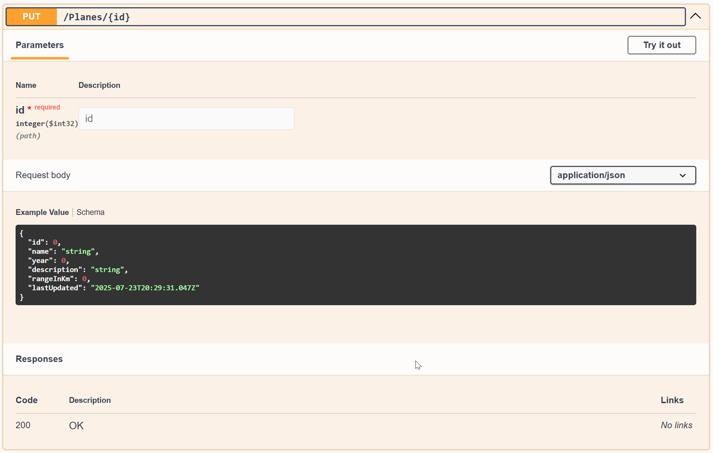
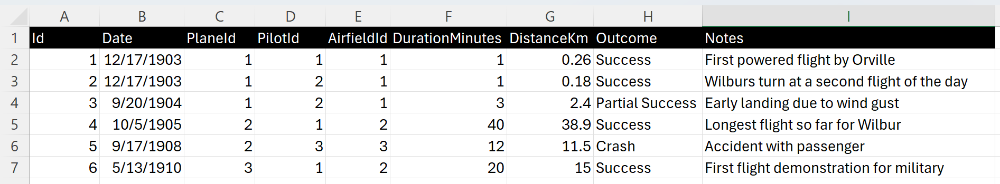

# Lab 2.3 - Navigating the Code Clouds: From Spec to Code

This lab exercise introduces GitHub Copilot's advanced features and shows you how to boost your coding efficiency. You'll practice tasks like adding new properties, generating documentation, refactoring code, and parsing strings. Optional labs will also cover context understanding and regex parsing.

## Prerequisites
- The prerequisites steps must be completed, see [Labs Prerequisites](../Lab%201.1%20-%20Pre-Flight%20Checklist/README.md)

## Estimated time to complete

- 30 minutes.

## Objectives

- To master GitHub Copilot's advanced features for solving complex coding exercises and optimizing code.
    - Step 1 - Flight Logbook - Logging Your Coding Journey
    - Step 2 - Flying in Formation - Code Refactoring
    - Step 3 - Implementing the PUT Endpoint from Image
    - Step 4 - Generating the FlightTrial Model and Controller from Excel Data
    - Step 5 - Creating and Running Unit Tests for FlightTrialsController
    - Step 6 - Refactoring the FlightTrialsController for Clean Code

---

### Step 1 - Flight Logbook - Logging Your Coding Journey
This step explores different ways to **document code using GitHub Copilot**. We'll focus on **the `GetById()` method in `PlanesController.cs`**, testing various documentation prompts and approaches.

Each section follows a **progressive structure**, introducing:
1. Simple documentation generation.
2. Instruction-based prompting.
3. Role-based documentation for API endpoints.
4. Chain-of-thought explanations for complex logic.
5. Meta-prompts for custom documentation strategies.
6. Automatic Documentation for Entire Files

#### Scenario 1: Simple Documentation using /doc
Quickly generate documentation using GitHub Copilot’s /doc feature for individual methods or an entire file.

- Open the `/WrightBrothersApi/Controllers/PlanesController.cs` file.

- Select all content of the method `GetById()` in `PlanesController.cs`.

- Right-click and choose `Generate Code` -> `Generate Docs`.

- View the updates, then click `Discard` to try a different approach.

> [!NOTE]
> GitHub Copilot uses the `/doc` agent to generate documentation for a **single method or the entire file** within seconds. This is a fast way to document your codebase, but we will explore **more controlled methods** using Copilot Chat.

#### Scenario 2: Simple Instruction-Based Prompt
Use a direct Copilot Chat prompt to generate XML documentation, including method purpose, parameters, and return values.

- Select all content of the method **`GetById()`** in `PlanesController.cs`.


Now that you’ve used Copilot Chat for focused, step-by-step improvements, let’s explore how Copilot Edits can make larger or repetitive changes even faster:

    ```
    Document this C# function, including its purpose, parameters, and return value.
    ```

- Review the generated XML documentation.

- View the updates, then click `Discard` to try a different approach.

    - Note: To update the code, you would click `Apply in Editor` button if the documentation is correct.

    **Example Output:**
    ```csharp
    /// <summary>
    /// Retrieves a plane by its unique identifier.
    /// </summary>
    /// <param name="id">The unique identifier of the plane.</param>
    /// <returns>The plane object if found; otherwise, NotFound result.</returns>
    ```

> [!NOTE]
> This approach provides a **quick** way to generate function-level doc comments. However, for **API documentation**, we will use a more structured role-based prompt.

#### Scenario 3: Role-Based Prompt for API Documentation
Generate structured API documentation with request parameters, response formats, and inline comments for better developer understanding.

- Select all content of the method **`GetById()`** in `PlanesController.cs`.

- Open **GitHub Copilot Chat**.

- Click `+` to clear prompt history.

- Type the following command.

    ```
    You are a technical writer. Write detailed documentation for this API endpoint, explaining its request parameters, response format, and usage examples. Additionally, add detailed comments to the GetById method in the PlanesController class, explaining each step and including error handling.
    ```

> [!NOTE]
> A **role-based prompt** helps Copilot produce structured API docs and clear inline comments. Framing it as a **technical writer** sets the tone, depth, and format. Start with technical writer, then try **API documentation specialist** or **senior software engineer** to compare styles and pick the best fit.

- Review the generated API documentation and inline comments.

- View the updates, then click `Discard` to try a different approach.

    - Note: To update the code, you would click `Apply in Editor` button if the documentation is correct.

<Br>

<details>
<summary>Example Output</summary>
    **Example Output:**
    ```csharp
    /// <summary>
    /// Retrieves a plane by its unique identifier.
    /// </summary>
    /// <param name="id">The unique identifier of the plane.</param>
    /// <returns>
    /// Returns an HTTP 200 OK response with the plane object if found.
    /// Returns an HTTP 404 Not Found response if the plane does not exist.
    /// </returns>
    [HttpGet("{id}")]
    public IActionResult GetById(int id)
    {
        try
        {
            // Attempt to find the plane by ID.
            var plane = _planeService.GetPlaneById(id);
            
            // If no plane is found, return 404 Not Found.
            if (plane == null)
            {
                return NotFound($"Plane with ID {id} not found.");
            }

            // Return the found plane with an HTTP 200 OK response.
            return Ok(plane);
        }
        catch (Exception ex)
        {
            // Log the exception and return an error response.
            _logger.LogError($"Error retrieving plane: {ex.Message}");
            return StatusCode(500, "Internal server error");
        }
    }
    ```

</details>

#### Scenario 4: Chain-of-Thought for Explaining Complex Logic
Break down complex logic step-by-step, adding inline comments for clarity and better maintainability.

- Select all content of the method **`GetById()`** in `PlanesController.cs`.

- Open **GitHub Copilot Chat**.

- Click `+` to clear prompt history.

- Paste the following prompt:

    ```
    Explain the logic of this function step-by-step, then add inline comments for clarity.
    ```

- Review Copilot’s explanation and inline comments.

- View the updates, then click `Discard` to try a different approach.

    - Note: To update the code, you would click `Apply in Editor` button if the documentation is correct.

    **Example Explanation**
    ```
    1. The method receives an integer `id` as input.
    2. It calls `_planeService.GetPlaneById(id)` to fetch the plane details.
    3. If the plane is not found, it returns `NotFound()`.
    4. If the plane is found, it returns the plane with `Ok()`.
    5. If an exception occurs, it logs the error and returns a `500 Internal Server Error`.
    ```

<Br>

<details>
<summary>Example Output</summary>
    **Example Code with Enhanced Inline Comments**
    ```csharp
    public IActionResult GetById(int id)
    {
        try
        {
            // Fetch the plane based on the provided ID.
            var plane = _planeService.GetPlaneById(id);

            // Check if the plane exists.
            if (plane == null)
            {
                // If not found, return a 404 Not Found response.
                return NotFound($"Plane with ID {id} not found.");
            }

            // If found, return the plane with an HTTP 200 OK response.
            return Ok(plane);
        }
        catch (Exception ex)
        {
            // If an error occurs, log it and return a 500 Internal Server Error.
            _logger.LogError($"Error retrieving plane: {ex.Message}");
            return StatusCode(500, "Internal server error");
        }
    }
    ```

</details>

> [!NOTE]
> This **Chain-of-Thought** method helps **break down logic step-by-step** for complex functions.

#### Scenario 5: Meta Prompt for Custom Documentation Needs
Optimize Copilot prompts to generate clean, consistent documentation across large projects.

- Close any files you have open.

- Open **GitHub Copilot Chat**.

- Click `+` to clear prompt history.

- Type the following meta-prompt:

    ```
    What’s the best way to prompt you to generate clean, consistent code documentation for large projects?
    ```

- Review Copilot’s recommendations.

- Use the suggested techniques to refine how you prompt Copilot for documentation.

> [!NOTE]
> This **meta-prompt** helps standardize documentation **across large projects**.

##### Scenario 6: Automatic Documentation for Entire Files
Generate bulk documentation for an entire file, ideal for legacy codebases and large projects.

- Do not select any content of the method in `PlanesController.cs`.

- Open **GitHub Copilot Chat**.

- Click `+` to clear prompt history.

- Paste the following prompt:

    ```
    Generate OpenAPI-style documentation comments for this file, ensuring that all request parameters, response formats, and HTTP status codes are documented. Be sure to add inline comments for clarity where needed.
    ```

- Review the generated **class-level summary** and **method-level comments**.

- View the updates, then click `Discard` to try a different approach.

    - Note: To update the code, you would click `Apply in Editor` button if the documentation is correct.

<Br>

<details>
<summary>Example Output</summary>
    **Example Output:**
    ```csharp
    /// <summary>
    /// Controller for managing aircraft data.
    /// Provides endpoints for retrieving planes by ID.
    /// </summary>
    [ApiController]
    [Route("api/[controller]")]
    public class PlanesController : ControllerBase
    {
        /// <summary>
        /// Retrieves a plane by its unique identifier.
        /// </summary>
        /// <param name="id">The unique identifier of the plane.</param>
        /// <returns>
        /// Returns an HTTP 200 OK response with the plane object if found.
        /// Returns an HTTP 404 Not Found response if the plane does not exist.
        /// </returns>
        [HttpGet("{id}")]
        public IActionResult GetById(int id)
        {
            try
            {
                // Fetch the plane based on the provided ID.
                var plane = _planeService.GetPlaneById(id);

                // Check if the plane exists.
                if (plane == null)
                {
                    return NotFound($"Plane with ID {id} not found.");
                }

                return Ok(plane);
            }
            catch (Exception ex)
            {
                _logger.LogError($"Error retrieving plane: {ex.Message}");
                return StatusCode(500, "Internal server error");
            }
        }
    }
    ```
</details>


#### Compare Copilot’s Documentation to Manual Documentation  

- Review the **Copilot-generated documentation**.

- Ask the following questions:
    - **Is anything missing?** (e.g., exception handling, request examples)
    - **Are all parameters and return types well explained?**
    - **Does this match your team’s documentation style?**

- If improvements are needed, manually refine the documentation.

> [!NOTE]  
> This **bulk documentation approach** is perfect for **onboarding new developers** or documenting **large, legacy codebases**.

By automating documentation for **entire files**, you can:  
✅ Save time when working with **large codebases**.  
✅ Ensure **consistent** documentation across **all methods**.  
✅ Improve **API documentation** using OpenAPI-style comments.  

For best results, **review and refine** the generated docs to align with your project’s standards.

---

### Step 2 - Flying in Formation - Code Refactoring

- Open the `Controllers/FlightsController.cs` file.

- Navigate to the `UpdateFlightStatus` method.

```csharp
public class FlightsController : ControllerBase
{
    // Other methods

    [HttpPost("{id}/status")]
    public ActionResult UpdateFlightStatus(int id, FlightStatus newStatus)
    {
        var flight = Flights.Find(f => f.Id == id);
        if (flight != null)

    /* Rest of the method bpdy */

    }
}
```

> [!NOTE]
> Note that the `UpdateFlightStatus` method has a high code complexity rating of 10+, calculated by the [Cyclomatic Complexity metric](https://en.wikipedia.org/wiki/Cyclomatic_complexity). This is a good candidate for refactoring.

- Select all the contents of the `UpdateFlightStatus()` method.

- Open `GitHub Copilot Chat`, select `Agent` click `+` to clear prompt history.

- Ask the following question:

  ```
  What is the cyclomatic complexity of this method UpdateFlightStatus?
  ```

> [!NOTE]
> In the case of the UpdateFlightStatus method, we can calculate the cyclomatic complexity by counting the number of decision points (if, switch-case, loops) plus 1. The cyclomatic complexity of the UpdateFlightStatus method is 10.

- Let's go ahead and refactor the code to make it more readable and maintainable.

- Why? Refactoring the UpdateFlightStatus method is important because it improves code clarity and maintainability by isolating business logic, making the system easier to update and debug.

- Open `GitHub Copilot Chat`, select `Agent` click `+` to clear prompt history.

- Add the following files to the `Working Set` near the bottom of Copilot Edits window.

- Click the `+ Add Context` button, select `Files and Folders`, then select these:
    - `WrightBrothersApi/Models/Flight.cs`
    - `WrightBrothersApi/Controllers/FlightsController.cs`

> [!NOTE]
> You can multi-select these files from the file explorer by holding the `Ctrl` down and `Left-Clicking` on each file. Then simply drag-n-drop them into Copilot Edits working set window.

- Copy/Paste the following in the Copilot Chat - Agent mode:

    ```prompt
    Refactor to reduce cyclomatic complexity of FlightsController.UpdateFlightStatus.

    Goal
    Move all status-transition rules into the Flight model, keep the controller focused on request handling.

    Files
    Edit only: Models/Flight.cs and Controllers/FlightsController.cs.

    1) Flight model
    Add exactly:
    public bool CanUpdateStatus(FlightStatus newStatus, out string reason)
    Use the existing FlightStatus enum, return true with empty reason when the transition from this.Status to newStatus is allowed, otherwise return false with a short reason string.

    2) Controller action
    Keep [HttpPost("{id}/status")] and the current method signature.
    Replace only the method body to:
    - find the flight by id, return NotFound if missing,
    - call CanUpdateStatus, return BadRequest with the reason if invalid,
    - if valid, set Status and return Ok with the updated flight.

    Guardrails
    No renames, no new files or DTOs, no namespace or route changes, compile must pass.
    Outcome
    Invalid transitions return 400 with a short message, valid transitions return 200 with the updated flight.
    ```

- Submit the prompt by pressing Enter.

- Copilot will update the `Flights` and `FlightsController` class.

- Review the updates in the file editor.


- Click `Accept` to save the changes, then click `Done` in the `Copilot Chat` window to complete this task.

> [!NOTE]
> This refactoring improves the readability and maintainability of the `UpdateFlightStatus` method by delegating the status validation logic to the `Flight` model. This keeps the controller focused on handling requests while the business logic is encapsulated within the model.

<Br>

<details>
<summary>Click for Solution</summary>

```csharp
[HttpPost("{id}/status")]
public ActionResult UpdateFlightStatus(int id, FlightStatus newStatus)
{
    var flight = Flights.Find(f => f.Id == id);
    if (flight != null)
    {
        var (isValid, reason) = flight.CanUpdateStatus(newStatus);
        if (!isValid)
        {
            return BadRequest(reason);
        }

        flight.Status = newStatus;
        return Ok($"Flight status updated to {newStatus}.");
    }
    else
    {
        return NotFound("Flight not found.");
    }
}
```

</details>

> [!NOTE]
> The output of GitHub Copilot Chat can vary, but the output should be a refactored method that is more readable and maintainable.

> [!NOTE]
> Note that GitHub Copilot Chat can make mistakes sometimes. Best practice is to have the method covered with unit tests before refactoring it. This is not a requirement for this lab, but it is a good practice to follow. These unit tests can be generated by GitHub Copilot as well, which is covered in a previous lab.

---

### Step 3 – Implementing the PUT Endpoint from Image

Your architect has already defined the contract for a new API endpoint: `PUT /planes/{id}`. Now it's your job to implement it.

This time, instead of generating code from scratch, you’ll use **GitHub Copilot Edits** and describe what you want based on the visual API spec provided in the screenshot.

1. Open `GitHub Copilot Chat`, select `Edit`, then click `+` for `New Session`.

2. Add the controller file to the **Copilot Edits working set**.
    - Click **+ Add Context** in the Edits panel, select `/Controllers/PlanesController.cs`, confirm it appears under **Working set**.

> [!NOTE]
> You can multiple select these files from the file explorer by holding the `Ctrl` down and clicking on each file. Then simply drag-n-drop them into the `Edit with Copilot` window.

> [!IMPORTANT]
> Adding files to the **Working set** gives Copilot direct context for where to write changes. Opening the file in the editor also works, but the working set is the most reliable way to target edits.

1. Right-click the image below and choose **Copy Image**.:

    

1. Paste the image directly into the **GitHub Copilot Edits** chat window.

1. Under the image, paste the prompt below into the **GitHub Copilot Edits** chat window:

   ```
   Create this API endpoint from the screenshot and append to end of #file:PlanesController.cs, after the existing code.
   ```

1. Review the Copilot-generated `PUT` method. It should:

   * Accept a plane ID as a route parameter.
   * Accept a `Plane` object in the request body.
   * Update the matching plane in the in-memory list.
   * Return HTTP 200 OK with the updated plane if successful.

1. Click **Keep** to insert the code.

1. Close the tab for `PlanesController.cs`.

> [!NOTE]
> Copilot is reading the shape of the method from your prompt and applying it directly into your controller. This mirrors a real-world scenario where teams pass specs via tickets or mockups.

---

### Step 4 – Generating the FlightTrial Model and Controller from Excel Data

We have this data that's been managed manually in Excel and will be migrated to the database. We need an API to access and manipulate the data programmatically via a new endpoint.

This time you'll use **GitHub Copilot Agent** mode to generate a new model and controller based on the image below.

1. Open **GitHub Copilot Chat** and make sure you are in **Agent** mode, not Edits.
   Use `Ctrl+Shift+I`, then select **+** for new edit session.

2. Right-click the image below and choose **Copy Image**:

   

3. Paste the image directly into the Copilot Chat window.

4. Paste the prompt directly below the image:

   ```
    Create the C# model called `FlightTrial` for this data and place it into the existing models folder next to #file:Plane.cs.  
    - Create the controller called `FlightTrialsController` and place it into the existing controllers folder next to #file:PlanesController.cs  
    Include all standard API CRUD operations.  
    - Build out the list of FlightTrials in the controller using the data from the screenshot.  
    - Ensure to add error handling for bad or missing data.  
    - Add validation attributes to the `FlightTrial` model:  
        - Use [Required] for all non-nullable fields  
        - Use [Range] for numeric values like `DistanceKm` and `DurationMinutes`  
        - Use [StringLength] or [MaxLength] where appropriate for `Notes` and `Outcome`  
        - Ensure that the controller returns BadRequest when the model state is invalid
   ```

5. Review the generated model and controller. Confirm that validation rules are in place and the data structure reflects the screenshot.

6. Click **Keep** and confirm the files were added to the right folders.

> [!NOTE]
> Agent Mode allows Copilot to work across multiple files and create a complete solution. You’re giving it structured instructions and real data to work from, just like an engineer importing a legacy system into a modern API.

---

### Step 5 – Creating and Running Unit Tests for FlightTrialsController

Now that you’ve created the new API, it’s time to confirm it works correctly by generating and running unit tests.

1. Open **GitHub Copilot Chat** and make sure you are in **Agent** mode, not Edits.
   Use `Ctrl+Shift+I`, then select **+** for new edit session.

1. Paste the following prompt:

   ```
    Create a new test controller called `FlightTrialsControllerTests.cs` and place it next to #file:PlanesControllerTests.cs.  
    - Create unit tests for everything in the #file:FlightTrialsController.cs.  
    - Ensure to handle both negative and positive test scenarios.  
    - Run all the unit tests using dotnet test and show me which ones pass or fail.  
    - If any tests fail, fix them in #file:FlightTrialsControllerTests.cs and rerun the tests until all tests pass.
   ```

1. If you're asked to build or run tests, click **Continue**.

Copilot will generate the tests, run them, fix them if they fail, and show the results. Most should pass, for example:

   ```sh
   Test summary: total: 11, failed: 0, succeeded: 11, skipped: 0
   ```

> [!NOTE]
> You’re now leveraging Agent Mode’s full power: multi-file editing, intelligent file placement, code generation, test execution, and iterative improvements—all in one chat window.

---

### Step 6 – Refactoring the FlightTrialsController for Clean Code

Now that your tests pass, let’s make the controller more robust by cleaning up the code structure and improving readability.

You’ve validated that your logic works—now it’s time to prepare it for real-world maintainability. This includes pulling out any repeated code, clarifying return values, and documenting the API.

1. Open **GitHub Copilot Chat** and make sure you are in **Agent** mode, not Edits.

1. Paste this prompt into GitHub Copilot Chat:

    ```
    Refactor FlightTrialsController.cs for improved readability and maintainability.
    - Extract repetitive logic into helper methods.
    - Add XML comments to each API method.
    - Ensure response codes are clear and proper status codes are returned for error conditions.
    - After refactoring, build the project to confirm it compiles successfully (no errors).
    - Rerun all unit tests. If any tests fail, fix the test code and rerun until all tests pass.
    ```

1. Close any open files.

> [!NOTE]
> Refactoring after tests pass helps ensure that improvements don’t introduce bugs. This is a common step before submitting production-ready code or opening a pull request.

---

### Congratulations you've made it to the end! &#9992; &#9992; &#9992;

#### And with that, you've now concluded this module. We hope you enjoyed it! &#x1F60A;
