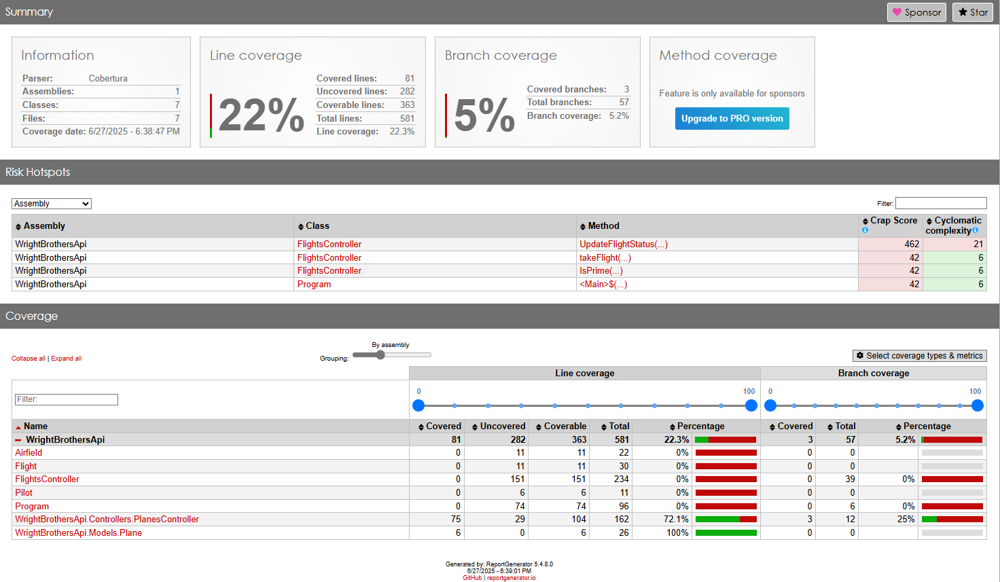

# Lab 2.3 – Code Coverage Reporting: Tower Clearance
This lab introduces GitHub Copilot Agent Mode for automating common development tasks using natural language prompts. You will use Agent Mode to set up, generate, and view code coverage reports for your backend project—no prior experience with coverage tools required.

## Prerequisites
- The prerequisites steps must be completed, see [Labs Prerequisites](../Lab%201.1%20-%20Pre-Flight%20Checklist/README.md)

## Estimated time to complete

- 10 minutes.

## Objective
- Experience how Copilot Agent Mode can automate repetitive tasks and streamline code quality reporting, all with simple, conversational prompts.
  - Step 1: Ask Copilot Agent for Code Coverage Insights
  - Step 2: Request a Complete Automated Setup
  - Step 3: Approve or Guide the Agent
  - Step 4: Watch Agent Mode Work
  - Step 5: Review and Explore

---

## Step 1: Ask Copilot Agent for Code Coverage Insights

- Open **GitHub Agent Mode**.

- Click `+` to clear prompt history.

- Type the following prompt:

```plaintext
How do I get insights on test coverage for my backend project and how do I display the test coverage in the browser?
```

- Copilot will respond with guidance on common tools and approaches for .NET code coverage (like Coverlet, ReportGenerator, or Cobertura reports).

> [!NOTE]
> Copilot might ask "Let me know if you want me to run these commands for you, or if you need help automating this process! You can respond yes OR go to step 2.

## Step 2: Request a Complete Automated Setup

Let’s see Agent Mode in action by requesting an end-to-end setup:

- In **GitHub Agent Mode**.

- Type the following prompt:

```plaintext
Install any required .NET tools and NuGet packages, then run the commands to generate an HTML code coverage report for my .NET 8 solution using Coverlet and ReportGenerator (Cobertura style). When finished, open the HTML report automatically in my browser.
```

> [!TIP]
> GitHub Copilot Agent Mode understands step-by-step tasks, so it should offer to install dependencies, update your test workflow, and generate the report.

- Once you’ve approved (or Agent Mode proceeds automatically), Copilot Agent Mode will
  - Install any necessary coverage tools for your backend project.
  - Run your test suite and generate a Cobertura-style coverage report.
  - Set up an easy way for you to view the report in your browser (such as generating an HTML report and launching it with a local server).

- You’ll see progress updates and instructions in the Agent Mode panel.

- Click `Continue` to let Copilot proceed with each task installations.
  - Agent mode will ask for confirmation before making changes many times.

- Wait for Agent Mode to complete all steps before moving on.

- Review the report and make sure it displays correctly.



## Step 3: Review and Explore

- Open the code coverage report in your browser (the agent will tell you where).
- Identify which parts of your code are tested and where you have gaps.

- Using **GitHub Agent Mode**.

- Type the following prompt:

```plaintext
Highlight any controllers or methods with low or zero test coverage in my backend project.
```

Let Agent Mode summarize which parts of the backend could use more testing!

## Why This Matters

Copilot Agent Mode isn’t just about writing code—it can automate whole dev tasks from setup to reporting. In this lab, you’ve used Agent Mode to set up a full code coverage workflow with just a few prompts. This is a great example of how natural language can streamline developer productivity.

### Congratulations you've made it to the end! &#9992; &#9992; &#9992;

#### And with that, you've now concluded this module. We hope you enjoyed it! &#x1F60A;