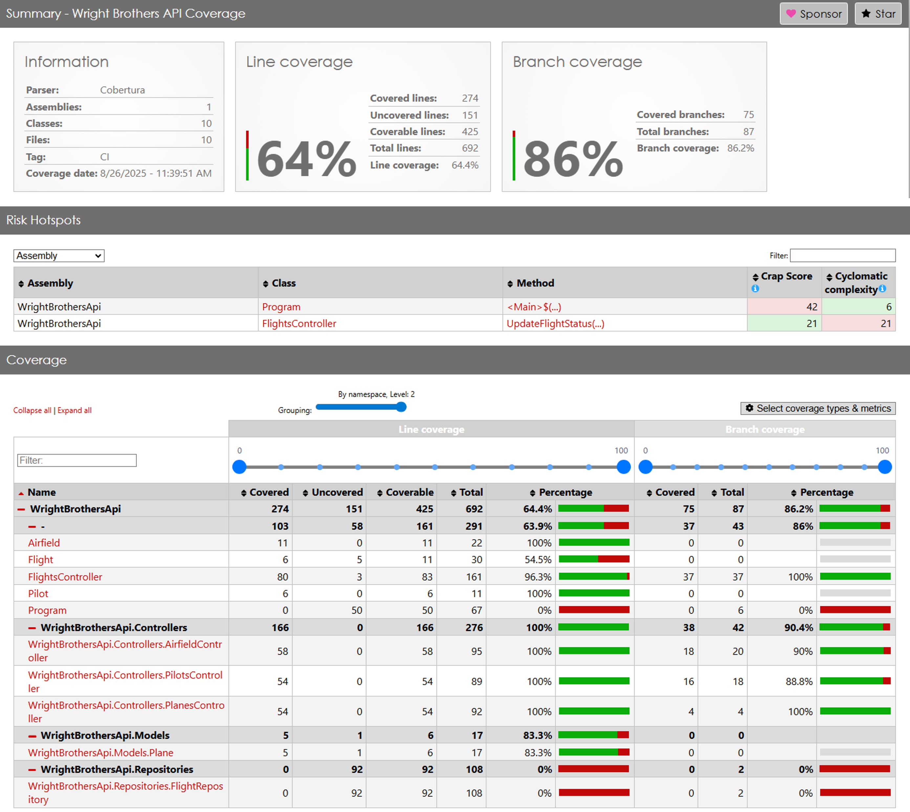
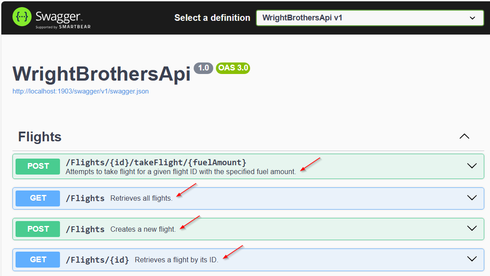

# Lab 2.4 – Tower Clearance: Agent Mode in Action

This lab introduces GitHub Copilot Agent Mode for automating common development tasks using natural language prompts. You will use Agent Mode to set up, generate, and view code coverage reports for your backend project—no prior experience with coverage tools required.

## Prerequisites
- The prerequisites steps must be completed, see [Labs Prerequisites](../Lab%201.1%20-%20Pre-Flight%20Checklist/README.md)

## Estimated time to complete

- 30 minutes.

## Objective
- Experience how Copilot Agent Mode can automate repetitive tasks and streamline code quality reporting, all with simple, conversational prompts.

  - Step 1 - Ascending to the Clouds - Creating the AirfieldController
  - Step 2 - Landing - Refactoring the AirfieldController
  - Step 3 - Test Flight Instrument Panel - Code Coverage Insights
  - Step 4 - Tower Signal: Generating API Documentation
  - Step 5 - Parsing Flight Show - Prompt Engineering
  - Step 6 - Regex Aerobatics Show - Advanced Prompt Engineering (Optional)

---

## Step 1 - Ascending to the Clouds: Creating the AirfieldController

In this step, you will use GitHub Copilot Edits to create a new AirfieldController with full CRUD and a matching test suite. The goal is to show how a focused prompt and a small working set can produce working code quickly, then give you a solid baseline for refactoring and coverage in later steps. When you finish, you will have a controller, sample data for historic airfields, and tests that confirm the basics.

- Open `GitHub Copilot Chat`, select `Edit` click `+` to clear prompt history.

- Click the `+ Add Context` button, select `Files and Folders`, then select these:
    - `/PlanesController.cs`
    - `/PlanesControllerTests.cs`
    - `/Airfield.cs`
    - Confirm all 3 appear under **Working set**.

> [!NOTE]
> You can multiple select these files from the file explorer by holding the `Ctrl` down and clicking on each file. Then simply drag-n-drop them into the `Edit with Copilot` window.

- Copy/Paste the following in the Copilot Chat window:

    ```prompt
    Create a new API Controller called "AirfieldController" with all the CRUD operations based on the Airfield class located in the file Airfield.cs. Ensure to follow the same style in PlanesController.
    
    ## Test Data
    Add test data to the AirfieldController for the first 3 airfields used by the Wright Brothers.
    
    ## Unit Tests
    Generate a new unit test controller called "AirfieldControllerTests" similar to the existing unit test file PlanesControllerTests.cs. Include comprehensive unit tests to cover all the methods in the AirfieldController.
    
    ## Details
    - Include explanations as comments in the test methods.
    - Use the xUnit framework for unit tests.
    - Ensure the unit tests cover all CRUD operations.
    - Use modern C# features such as pattern matching and async streams.
    - Use var instead of explicit types when the type is obvious.
    - Include error handling for asynchronous operations.
    - Use async/await syntax for asynchronous programming.

    ## Public Code Matching
    - Create in a trivial way to not match public code.
    ```

- Submit the prompt by pressing Enter.

> [!WARNING]
> If you see **Sorry, the response matched public code so it was blocked. Please rephrase your prompt.** message, try asking Copilot to rephrase the prompt to avoid matching public code".  You can also slightly modify the prompt and try again by appending "in a trivial way to not match public code" to the end of the prompt.

- Copilot will generate a new controller and the unit tests for the `Airfield` class.

- Review the updates in the file editor.


- Click `Keep` to save the changes in the `Copilot Edits`.

> [!NOTE]
> Copilot is not only context aware, knows you need a list of items and knows the historic`Air Fields` used by the Wright Brothers, like `Huffman Prairie`, which is the first one used by the Wright Brothers.

- Now that you have created the `AirfieldController` with CRUD operations, it's time to ensure that it's working as expected. In this step, you will run the new `AirfieldController` unit tests.

- Let's run the unit tests in the terminal.  From the terminal, run the following command:

    ```sh
    dotnet test ./WrightBrothersApi.Tests/WrightBrothersApi.Tests.csproj
    ```


- The tests should run and many will pass.

    ```sh
    Test summary: total: 15, failed: 2, succeeded: 13, skipped: 0
    ```

- If any tests fail, you can use Copilot to help fix them. Copy the following prompt and paste it into the Copilot Edits Chat window:

    ```
    Fix any failing tests in AirfieldControllerTests.cs. Review the test methods and ensure they correctly test the corresponding methods in AirfieldController.cs. Make sure to handle any exceptions or edge cases that might cause the tests to fail.
    ```

- If Copilot suggests changes, review them in the file editor, then click `Keep` to save the changes.

- Rerun the tests again until all tests pass.

---

### Step 2 - Landing: Refactoring the AirfieldController

In this step, we will refactor the AirfieldController and unit tests to improve its code quality and add additional functionalities. We will also enhance the unit tests to cover the new functionalities.

- Open **GitHub Copilot Edits** and make sure you are in **Edits** mode, not Agent.
   Use `Ctrl+Shift+I`, then select **+** for new edit session.

- Add the controller file to the **Copilot Edits working set**.
    - Click **+ Add files** in the Edits panel, select `AirfieldController.cs` and `AirfieldControllerTests.cs`, confirm it appears under **Working set**.

- Copy/Paste the following in the Copilot Edits Chat window:

    ```md
    Refactor to use async/await for all CRUD operations. Ensure that error handling is included for asynchronous operations.

    ## AirfieldController.cs
    - Use modern C# features such as pattern matching and async streams where applicable.

    ## AirfieldControllerTests.cs
    - Use the xUnit framework for the unit tests.

    ## Public Code Matching
    - Create in a trivial way to not match public code.
    ```

    

- Submit the prompt by pressing Enter.

- Copilot will update the controller and the unit tests for the `AirfieldController` class.

- Review the updates in the file editor.

- Click `Keep` in the `working set` window to save the changes, then click `Done` in the `Copilot Edits` window to complete this task.

> [!NOTE]
> GitHub Copilot will then generate the refactored code for the AirfieldController and AirFieldControllerTests using async/await for all CRUD operations, including error handling. You can review the generated code and make any necessary adjustments.

<Br>

<details>
<summary>Click for Controller Solution</summary>

```csharp
using Microsoft.AspNetCore.Mvc;
using WrightBrothersApi.Models;
using System.Collections.Generic;
using System.Linq;
using System.Threading.Tasks;

namespace WrightBrothersApi.Controllers
{
    [Route("api/[controller]")]
    [ApiController]
    public class AirfieldController : ControllerBase
    {
        private static readonly List<Airfield> Airfields = new List<Airfield>
        {
            new Airfield("Kitty Hawk", "North Carolina, USA", "1900-1903", "First successful powered flights"),
            new Airfield("Huffman Prairie", "Ohio, USA", "1904-1905", "Development of practical flying techniques"),
            new Airfield("Le Mans", "France", "1908", "First public demonstration of flight")
        };

        [HttpGet]
        public async Task<ActionResult<IEnumerable<Airfield>>> GetAirfields()
        {
            return await Task.FromResult(Ok(Airfields));
        }

        [HttpGet("{name}")]
        public async Task<ActionResult<Airfield>> GetAirfield(string name)
        {
            var airfield = await Task.Run(() => Airfields.FirstOrDefault(a => a.Name == name));
            return airfield switch
            {
                null => NotFound(),
                _ => Ok(airfield)
            };
        }

        [HttpPost]
        public async Task<ActionResult<Airfield>> CreateAirfield(Airfield airfield)
        {
            await Task.Run(() => Airfields.Add(airfield));
            return CreatedAtAction(nameof(GetAirfield), new { name = airfield.Name }, airfield);
        }

        [HttpPut("{name}")]
        public async Task<IActionResult> UpdateAirfield(string name, Airfield updatedAirfield)
        {
            var airfield = await Task.Run(() => Airfields.FirstOrDefault(a => a.Name == name));
            if (airfield is null)
            {
                return NotFound();
            }

            airfield.Location = updatedAirfield.Location;
            airfield.DatesOfUse = updatedAirfield.DatesOfUse;
            airfield.Significance = updatedAirfield.Significance;
            return NoContent();
        }

        [HttpDelete("{name}")]
        public async Task<IActionResult> DeleteAirfield(string name)
        {
            var airfield = await Task.Run(() => Airfields.FirstOrDefault(a => a.Name == name));
            if (airfield is null)
            {
                return NotFound();
            }

            await Task.Run(() => Airfields.Remove(airfield));
            return NoContent();
        }
    }
}

```
</details>

<Br>

<details>
<summary>Click for Unit Tests Solution</summary>

```csharp
using WrightBrothersApi.Controllers;
using WrightBrothersApi.Models;
using Microsoft.AspNetCore.Mvc;
using System.Collections.Generic;
using System.Threading.Tasks;
using Xunit;

namespace WrightBrothersApi.Tests.Controllers
{
    public class AirfieldControllerTests
    {
        private readonly AirfieldController _controller;

        public AirfieldControllerTests()
        {
            _controller = new AirfieldController();
        }

        [Fact]
        public async Task GetAirfields_ReturnsAllAirfields()
        {
            // Act
            var result = await _controller.GetAirfields();

            // Assert
            var actionResult = Assert.IsType<OkObjectResult>(result.Result);
            var airfields = Assert.IsType<List<Airfield>>(actionResult.Value);
            Assert.Equal(3, airfields.Count);
        }

        [Fact]
        public async Task GetAirfield_ReturnsCorrectAirfield()
        {
            // Act
            var result = await _controller.GetAirfield("Kitty Hawk");

            // Assert
            var actionResult = Assert.IsType<OkObjectResult>(result.Result);
            var airfield = Assert.IsType<Airfield>(actionResult.Value);
            Assert.Equal("Kitty Hawk", airfield.Name);
        }

        [Fact]
        public async Task GetAirfield_ReturnsNotFound()
        {
            // Act
            var result = await _controller.GetAirfield("Nonexistent Airfield");

            // Assert
            Assert.IsType<NotFoundResult>(result.Result);
        }

        [Fact]
        public async Task CreateAirfield_AddsNewAirfield()
        {
            // Arrange
            var newAirfield = new Airfield("New Airfield", "New Location", "2023", "New Significance");

            // Act
            var result = await _controller.CreateAirfield(newAirfield);

            // Assert
            var actionResult = Assert.IsType<CreatedAtActionResult>(result.Result);
            var createdAirfield = Assert.IsType<Airfield>(actionResult.Value);
            Assert.Equal("New Airfield", createdAirfield.Name);
        }

        [Fact]
        public async Task UpdateAirfield_UpdatesExistingAirfield()
        {
            // Arrange
            var updatedAirfield = new Airfield("Kitty Hawk", "Updated Location", "Updated Dates", "Updated Significance");

            // Act
            var result = await _controller.UpdateAirfield("Kitty Hawk", updatedAirfield);

            // Assert
            Assert.IsType<NoContentResult>(result);
        }

        [Fact]
        public async Task UpdateAirfield_ReturnsNotFound()
        {
            // Arrange
            var updatedAirfield = new Airfield("Nonexistent Airfield", "Updated Location", "Updated Dates", "Updated Significance");

            // Act
            var result = await _controller.UpdateAirfield("Nonexistent Airfield", updatedAirfield);

            // Assert
            Assert.IsType<NotFoundResult>(result);
        }

        [Fact]
        public async Task DeleteAirfield_DeletesExistingAirfield()
        {
            // Act
            var result = await _controller.DeleteAirfield("Kitty Hawk");

            // Assert
            Assert.IsType<NoContentResult>(result);
        }

        [Fact]
        public async Task DeleteAirfield_ReturnsNotFound()
        {
            // Act
            var result = await _controller.DeleteAirfield("Nonexistent Airfield");

            // Assert
            Assert.IsType<NotFoundResult>(result);
        }
    }
}
```
</details>

<Br>

Now that you have updated the `AirfieldController`, it's time to ensure that it works as expected by running the `AirfieldControllerTests` unit tests.

- Switch **GitHub Copilot Chat** to **Agent Mode**, then click `+` for `New Edit Session`.

- Paste in the following prompt:

   ```
    Run all the unit tests for the AirfieldControllerTests.  
    - Run them using dotnet test and show me which ones pass or fail.  
    - If any tests fail, fix them in AirfieldControllerTests.cs and rerun the tests until all tests pass.  
   ```

- If Copilot suggests changes, review them in the file editor, then click `Keep` to save the changes.

- Rerun the tests again until all tests pass.

- Most tests should pass, for example:

    ```sh
    Test summary: total: 7, failed: 0, succeeded: 7, skipped: 0
    ```

> [!NOTE]
> It’s normal for some tests to fail on the first run. Copilot can suggest fixes, but it’s your responsibility as the Pilot to debug, review, and finalize changes before considering the code ready

---

## Step 3 - Test Flight Instrument Panel - Code Coverage Insights

In this step, you will use GitHub Copilot Agent Mode to get insights on test coverage for your backend project and display the test coverage in the browser.

- Open `GitHub Copilot Chat`, select `Agent` click `+` to clear prompt history.

- Paste the following prompt:

```plaintext
How do I get insights on test coverage for my backend project and how do I display the test coverage in the browser?
```

- Copilot will respond with guidance on common tools and approaches for .NET code coverage (like Coverlet, ReportGenerator, or Cobertura reports).

> [!NOTE]
> Copilot might ask "Let me know if you want me to run these commands for you, or if you need help automating this process! You can respond yes.

Let’s see this in action by requesting an end-to-end setup:

- Paste the following prompt:

    ```prompt
    - Generate a .NET code coverage report for test project `WrightBrothersApi.Tests` project using Cobertura format and ReportGenerator.
    - Run tests with coverage enabled (dotnet test /p:CollectCoverage=true /p:CoverletOutputFormat=cobertura).
    - Install ReportGenerator if it’s not already installed (dotnet tool install -g dotnet-reportgenerator-globaltool).
    - Generate an HTML report in a coveragereport folder.
    - Open the coveragereport/index.html file in the default browser.
    ```

> [!TIP]
> GitHub Copilot Agent Mode understands step-by-step tasks, so it should offer to install dependencies, update your test workflow, and generate the report.

- Once you’ve approved (or Agent Mode proceeds automatically), Copilot Agent Mode will
  - Install any necessary coverage tools for your backend project.
  - Run your test suite and generate a Cobertura-style coverage report.
  - Set up an easy way for you to view the report in your browser (such as generating an HTML report and launching it with a local server).

- You’ll see progress updates and instructions in the Agent Mode panel.

- Click `Continue` to let Copilot proceed with each task installations.
  - Agent mode will ask for confirmation before making changes many times.

- Wait for Agent Mode to complete all steps before moving on.

- Review the report and make sure it displays correctly.

<br>

<details>
<summary>Click for Code Coverage Solution</summary>
    
</details>

<br>

Now that you have generated the code coverage report, it's time to review and explore the results. Let's see how Copilot can help you identify which parts of your code are tested and where you have gaps.

- Using **GitHub Copilot Chat**, **Agent Mode**.

- Paste the following prompt:

```plaintext
Highlight any controllers or methods with low or zero test coverage in my backend project.
```

Agent Mode will summarize which parts of the backend could use more testing!

## Why This Matters

Copilot Agent Mode isn’t just about writing code—it can automate whole dev tasks from setup to reporting. In this lab, you’ve used Agent Mode to set up a full code coverage workflow with just a few prompts. This is a great example of how natural language can streamline developer productivity.

---

### Step 4 – Tower Signal: Generating API Documentation

Now that you’ve created and refactored your controllers and verified code coverage, it’s time to generate **API-level documentation**.

In a previous lab, you explored how Copilot can help write inline documentation comments for individual methods. In this step, we’ll go further by using **Agent Mode** to generate consistent XML summaries across your controllers and wire up Swagger/OpenAPI so your APIs are easy to explore in a browser. This moves beyond internal developer notes and provides a clear reference for anyone consuming your API.

1. Switch GitHub Copilot Chat to **Agent Mode**, then click **+ New Edit Session**.

1. Add the following file(s) to your **Working Set** or open them in the editor:

   * `FlightsController.cs`
   * *(Optional)* `AirfieldController.cs`
   * *(Optional)* `PlanesController.cs`
   * *(Optional)* `FlightTrialsController.cs`

1. Paste the following prompt into the Copilot Agent Mode chat:

   ```plaintext
   Generate OpenAPI-style documentation comments for all controllers in my project.  
   - Add XML documentation comments to each method, describing its purpose, parameters, and return values.  
   - Include HTTP status codes (200, 201, 400, 404, 500 where applicable).  
   - Ensure summaries are clear and developer-friendly.  
   - If possible, configure Swagger by adding a `swagger.json` file and enabling Swagger UI in the project.  
   - Place generated XML comments directly into the relevant controller files.
   ```

- Click `Keep` to save the changes in the `Copilot Chat` window to complete this task.

Next we need to enable XML docs in the project and wire them into Swagger by updating the `WrightBrothersApi.csproj` and `Program.cs`, this ensures your summaries and response codes show up in the UI instead of just route names.

1. Rather than manually editing these files, let’s use Agent Mode to make these changes for us. Paste this follow-up prompt into the same chat:

   ```plaintext
   Update WrightBrothersApi.csproj to enable XML documentation with  
   <GenerateDocumentationFile>true</GenerateDocumentationFile>  
   <NoWarn>$(NoWarn);1591</NoWarn>  

   Then update Program.cs to include the XML doc file in SwaggerGen using Assembly.GetExecutingAssembly().  
   Ensure Swagger UI will display method summaries and response codes.
   ```

Copilot will now:

✅ Add XML comments above your API methods.  
✅ Enable XML documentation in the `WrightBrothersApi.csproj`.  
✅ Update `Program.cs` so Swagger reads the XML doc file.  
✅ Suggest return codes and response details for each endpoint.  


   Example in `AirfieldController.cs`:

   ```csharp
   /// <summary>
   /// Retrieves all available airfields.
   /// </summary>
   /// <returns>
   /// HTTP 200 OK with a list of airfields.
   /// </returns>
   [HttpGet]
   public async Task<ActionResult<IEnumerable<Airfield>>> GetAirfields()
   {
       return await Task.FromResult(Ok(Airfields));
   }
   ```

1. Rebuild and run the project. Ensure your terminal is pointed to the root folder of the project (./WrightBrothersApi/WrightBrothersApi), then run:

   ```bash
   dotnet run
   ```

1. Open the Swagger endpoint (default: `https://localhost:5001/swagger`).
   You should now see controllers and routes with descriptions, parameters, and return values.

     

1. Press `Ctrl+C` in the terminal to stop the running project.

> [!NOTE]
> By letting Copilot update your project setup instead of editing by hand, you ensure every lab will display API documentation correctly in Swagger with minimal effort. Swagger integration makes your APIs self-explanatory and discoverable in the browser.

---

### Step 5 - Parsing Flight Show - Prompt Engineering

- Open the `Models/Flight.cs` file.

- Take a look at the `FlightLogSignature` property.

    ```csharp
    public class Flight
    {
        // Other properties
        // ...

        public string FlightLogSignature { get; set; }
    }
    ```

- This property is used in the `FlightsController` and assigned a hard to read value, i.e. **FlightLogSignature = "171203-DEP-ARR-WB001"**,

- Open `GitHub Copilot Chat`, select `Edit` click `+` to clear prompt history.

- Click the `+ Add Context` button, select `Files and Folders`, then select these:
    - `Flight.cs`
    - `FlightsController.cs`
    - Confirm both appear under **Working set**.

> [!NOTE]
> You can multi-select these files from the file explorer by holding the `Ctrl` down and `Left-Clicking` on each file. Then simply drag-n-drop them into Copilot Edits working set window.

- Copy/Paste the following in the Copilot Edits Chat window:

    ```prompt
    Create a new C# model for a FlightLogSignature property.

    ## Example
    17121903-DEP-ARR-WB001

    ## Example Details
    17th of December 1903
    Departure from Kitty Hawk, NC
    Arrival at Manteo, NC
    Flight number WB001

    ## Technical Requirements
    - Create a record type named FlightLog in a new file called FlightLog.cs.
    - Implement a Parse method in the FlightLog record type to parse a FlightLogSignature.
    - Ensure the FlightLogSignature consists of exactly four parts separated by -. The format should be:
        - {Date}{DEP}{ARR}{FlightNumber}
        - Example: 17121903-DEP-ARR-WB001
    - Parse the Date as DateTime (format: ddMMyyyy).
    - Include necessary using statements at the top of the file.
    - Use a try-catch block inside Parse to catch and handle any parsing errors.
    - Add a read-only FlightLog property (getter only) to the Flight model.
    - Include explanations as comments.
    ```

- The prompt contains a few-shot prompting example of a `FlightLogSignature` and a few technical requirements.

- Press `Enter` to submit the prompt.

> [!NOTE]
> Few-Shot prompting is a concept of prompt engineering. In the prompt you provide a demonstration of the solution. In this case we provide examples of the input and also requirements for the output. This is a good way to instruct Copilot to generate specific solutions.

- Take a look at the following link to learn more about few-shot prompting: https://www.promptingguide.ai/techniques/fewshot

- Copilot will suggest a new `FlightLog` record type and a `Parse` method. The `Parse` method splits the string and assigns each part to a corresponding property.

> [!NOTE]
> A C# record type is a reference type that provides built-in functionality for encapsulating data. It is a reference type that is similar to a class, but it is immutable by default. It is a good choice for a simple data container.

> [!NOTE]
> GitHub Copilot is very good at understanding the context of the code. From the prompt we gave it, it understood that the `FlightLogSignature` is a string in a specific format and that it can be parsed into a `FlightLogSignature` model, to make the code more readable and maintainable.

- Review the updates in the file editor.

    

- You can choose to `Keep` or `Discard` the changes in the file editor or the `Working Set` window.

- Copilot created a new class `FlightLog` file and updated the `Flight` model with the getter property.

- Click `Keep` to save the changes, then click `Done` in the `Copilot Edits` window to complete this task.

- If Copilot didn't suggest the code above, then update the code manually as follows:

<Br>

<details>
<summary>Click for Solution - FlightLog</summary>

```csharp
public record FlightLog(DateTime Date, string Departure, string Arrival, string FlightNumber)
{
    public static FlightLog Parse(string flightLogSignature)
    {
        try
        {
            var parts = flightLogSignature.Split('-');
            if (parts.Length != 4)
            {
                throw new FormatException("FlightLogSignature must consist of exactly four parts separated by '-'.");
            }

            var date = DateTime.ParseExact(parts[0], "ddMMyyyy", null);
            var departure = parts[1];
            var arrival = parts[2];
            var flightNumber = parts[3];

            return new FlightLog(date, departure, arrival, flightNumber);
        }
        catch (Exception ex)
        {
            throw new ArgumentException("Invalid FlightLogSignature format.", ex);
        }
    }
}
```
</details>

<Br>

<details>
<summary>Click for Solution - Flight</summary>

    ```csharp
    public class Flight
    {
        // Other properties
        // ...

        // Existing property
        public string FlightLogSignature { get; set; }

        // New property
        public FlightLog FlightLog => FlightLog.Parse(FlightLogSignature);
    }
    ```
</details>

<Br>

> [!NOTE]
> Copilot used the newly created `FlightLog.cs` file in in its context and suggested the `FlightLog.Parse()` method.

- Now, run the app and test the new functionality.

    ```bash
    cd WrightBrothersApi
    dotnet run
    ```

> [!NOTE]
> If you encounter an error message like `Project file does not exist.` or `Couldn't find a project to run.`, it's likely that you're executing the command from an incorrect directory. To resolve this, navigate to the correct directory using the command `cd ./WrightBrothersApi`. If you need to move one level up in the directory structure, use the command `cd ..`. The corrcect directory is the one that contains the `WrightBrothersApi.csproj` file.

- Open the `WrightBrothersApi/Examples/Flights.http` file and POST a new flight.


- Click the `Send Request` button for the `POST` below:

    ```json
    POST http://localhost:1903/flights HTTP/1.1
    ```

- The Rest Client response will now include the `FlightLog` property as follows:

    ```json
    HTTP/1.1 201 Created
    Connection: close
    {
        "id": 4,
        "flightLogSignature": "17091908-DEP-ARR-WB004",
        "flightLog": {
            "date": "1908-09-17T00:00:00",
            "departure": "DEP",
            "arrival": "ARR",
            "flightNumber": "WB004"
        },
    }
    ```

- Note the `flightLog` property that is parsed based on the ` flightLogSignature`

- Stop the app by pressing `Ctrl + C` or `Cmd + C` in the terminal.

---

## Optional

### Step 6 - Regex Aerobatics Show - Advanced Prompt Engineering

> [!NOTE]
> This is an advanced lab exercise. We take Copilot to the edge of its capabilities. Retry the prompt provided later in the lab if you are not successful the first time.

- Open the `Flight.cs` file.

- Take a look at the `AerobaticSequenceSignature` property to the `Flight.cs` file.

    ```csharp
    public class Flight
    {
        // Other properties
        // ...

        // Existing property
        public string AerobaticSequenceSignature { get; set; }
    }
    ```

- The `AerobaticSequenceSignature` is a fictional property that is used to demonstrate the capabilities of GitHub Copilot. It is not a real aviation concept.

- Some examples of a `AerobaticSequenceSignature` are:
    - L4B-H2C-R3A-S1D-T2E
    - L1A-H1B-R1C-T1E
    - L2A-H2B-R2C

- Use prompt engineering techniques to set intent, frame the task, and guide Copilot toward a clear, consistent implementation for the `AerobaticSequenceSignature` property. Keep the cue concise, prefer a brief plan followed by code, and let the prompt carry the specifics.

- Open `GitHub Copilot Chat`, select `Edit` click `+` to clear prompt history.

- Click the `+ Add Context` button, select `Files and Folders`, then select these:
    - `Flight.cs`
    - `FlightsController.cs`
    - Confirm both appear under **Working set**.

> [!NOTE]
> You can multi-select these files from the file explorer by holding the `Ctrl` down and `Left-Clicking` on each file. Then simply drag-n-drop them into Copilot Edits working set window.

- Copy/Paste the following in the Copilot Edits Chat window:

    ```prompt
    Create a new C# model for a AerobaticSequenceSignature property.

    ## AerobaticSequence Examples
    - L4B-H2C-R3A-S1D-T2E
    - L1A-H1B-R1C-T1E
    - L2A-H2B-R2C

    ## Maneuver
    - Manouvers: L = Loop, H = Hammerhead, R = Roll, S = Spin, T = Tailslide
    - Number represents repeat count
    - The Letter represents difficulty (A-E)
    - Difficulty multipliers: A = 1.0, B = 1.2, C = 1.4, D = 1.6, E = 1.8

    ## AerobaticSequence Difficulty Method
    - Add a difficulty calculation method with the following rules:
    - A roll after a loop is scored double
    - A spin after a tailslide is scored triple

    ## Chain-of-Thought reasoning
    Example: L4B-R3A-H2C-T2E-S1D

    - Loop: 4 * 1.2 = 4.8
    - Roll: 3 * 1 * 2(roll after a loop) = 6.0
    - Hammerhead: 2 * 1.4 = 2.8
    - Tailslide: 2 * 1.8 = 3.6
    - Spin: 1 * 1.6 * 3(spin after a tailslide) = 4.8

    Total: 22

    ## Technical Requirements
    - Create a new file in the existing models folder for AerobaticSequence class with a list of Maneuvers and a difficulty property.
    - Add the Maneuver class inside the AerobaticSequence class.
    - Use static Parse method to parse the AerobaticSequenceSignature.
    - Parse the signature with a Regex.
    - Include usings at the top of the file.
    - Round the difficulty result to 2 decimal places.
    - Add the AerobaticSequence read-only property with only a getter to the existing Flight class.

    Outline your approach in a few bullets, then implement.
    ```

- Submit the prompt by pressing Enter.

- Copilot will update the `Flights` and create a `AerobaticSequence` class.

- Review the updates in the file editor.


- Click `Keep` to save the changes, then click `Done` in the `Copilot Edits` window to complete this task.

> [!IMPORTANT]
> Sometimes the Copilot doens't complete the output of the prompt. Make sure to try the prompt again if you are not successful the first time.

- Note the `Chain-of-Thought reasoning` heading. In this case we add reasoning about how a difficulty is calculated based on the sequence of maneuvers.

> [!NOTE]
> Chain-of-Thought (CoT) prompting enables complex reasoning capabilities through intermediate reasoning steps. You can combine it with Few-Shot prompting to get better results on more complex tasks that require reasoning before responding. Read more about Chain-of-Thought prompting here: https://www.promptingguide.ai/techniques/cot

- Note the `Let's think step by step.` at the end of the prompt engineering. This is the final instruction for Chain-of-Thought to make Copilot go through the process step by step, like a human would do.

- Also note the Few-Shot examples in the `AerobaticSequence Examples` heading. Chain-of-Thought with Few-Shot combined is the currently the most powerful way to instruct Copilot to generate specific and accurate solutions. Still it doesn't guarantee that Copilot will generate the correct solution. That will require fine-tuning the prompt (prompt engineering).

- Copilot will output something that looks as follows after inserting the prompt above in Copilot Chat:

    ```md
    Step-by-Step Solution:
    - Create a new file AerobaticSequence.cs in the Models folder.
    - Define the AerobaticSequence class with a list of Maneuver and a Difficulty property.
    - Define the Maneuver class inside the AerobaticSequence class.
    - Implement a static Parse method to parse the AerobaticSequenceSignature using a Regex.
    - Add a method to calculate the difficulty of the aerobatic sequence.
    - Add a read-only AerobaticSequence property to the existing Flight class.
    ```

- This is the output of the Chain-of-Thought reasoning. It is a step by step guide to create the `AerobaticSequence` class. Copilot is thinking step by step, like a human would do.

- Copilot will also suggest a `AerobaticSequence` class with an implementation that looks like this. The result varies, but the output should be a `AerobaticSequence` class with a `Maneuver` class, a `Parse` method and a `CalculateDifficulty` method.

- If Copilot didn't suggest the code properly, then update the code manually as follows:

<Br>

<details>
<summary>Click for Solution - AerobaticSequence</summary>

```csharp
using System;
using System.Collections.Generic;
using System.Linq;
using System.Text.RegularExpressions;

namespace WrightBrothersApi.Models
{
    public class AerobaticSequence
    {
        public List<Maneuver> Maneuvers { get; private set; }
        public double Difficulty => CalculateDifficulty();

        public AerobaticSequence(List<Maneuver> maneuvers)
        {
            Maneuvers = maneuvers;
        }

        public static AerobaticSequence Parse(string signature)
        {
            var maneuvers = new List<Maneuver>();
            var regex = new Regex(@"([LHRST])(\d)([A-E])");
            var matches = regex.Matches(signature);

            foreach (Match match in matches)
            {
                var type = match.Groups[1].Value;
                var count = int.Parse(match.Groups[2].Value);
                var difficulty = match.Groups[3].Value;

                maneuvers.Add(new Maneuver(type, count, difficulty));
            }

            return new AerobaticSequence(maneuvers);
        }

        private double CalculateDifficulty()
        {
            double totalDifficulty = 0.0;
            for (int i = 0; i < Maneuvers.Count; i++)
            {
                var maneuver = Maneuvers[i];
                double multiplier = maneuver.DifficultyMultiplier;

                if (i > 0)
                {
                    var previousManeuver = Maneuvers[i - 1];
                    if (maneuver.Type == "R" && previousManeuver.Type == "L")
                    {
                        multiplier *= 2;
                    }
                    else if (maneuver.Type == "S" && previousManeuver.Type == "T")
                    {
                        multiplier *= 3;
                    }
                }

                totalDifficulty += maneuver.Count * multiplier;
            }

            return Math.Round(totalDifficulty, 2);
        }

        public class Maneuver
        {
            public string Type { get; }
            public int Count { get; }
            public string Difficulty { get; }
            public double DifficultyMultiplier => Difficulty switch
            {
                "A" => 1.0,
                "B" => 1.2,
                "C" => 1.4,
                "D" => 1.6,
                "E" => 1.8,
                _ => 1.0
            };

            public Maneuver(string type, int count, string difficulty)
            {
                Type = type;
                Count = count;
                Difficulty = difficulty;
            }
        }
    }
```
</details>

<Br>

<details>
<summary>Click for Solution - Flight</summary>

```csharp
public class Flight
{
    // Other properties
    // ...

    // Existing property
    public string AerobaticSequenceSignature { get; set; }

    // New property
    public AerobaticSequence AerobaticSequence => AerobaticSequence.Parse(AerobaticSequenceSignature);
}
```
</details>

<Br>

- Now, run the app again and test the new functionality.

    ```bash
    dotnet run
    ```

> [!NOTE]
> If you encounter an error message like `Project file does not exist.` or `Couldn't find a project to run.`, it's likely that you're executing the command from an incorrect directory. To resolve this, navigate to the correct directory using the command `cd ./WrightBrothersApi`. If you need to move one level up in the directory structure, use the command `cd ..`. The corrcect directory is the one that contains the `WrightBrothersApi.csproj` file.

- Open `WrightBrothersApi/Examples/Flights.http` file in the Visual Studio code IDE and POST a new flight.


- Click the `Send Request` button for the `POST` below:

    ```json
    POST http://localhost:1903/flights HTTP/1.1
    ```

- The Rest Client response will now include the `AerobaticSequence` property as follows:

    ```json
    HTTP/1.1 201 Created
    Connection: close
    {
        "id": 4,
        "aerobaticSequenceSignature": "L4B-H2C-R3A-S1D-T2E",
        "aerobaticSequence": {
            "maneuvers": [
                {
                    "type": "L",
                    "repeatCount": 4,
                    "difficulty": "B"
                },
                {
                    "type": "H",
                    "repeatCount": 2,
                    "difficulty": "C"
                },
                {
                    "type": "R",
                    "repeatCount": 3,
                    "difficulty": "A"
                },
                {
                    "type": "S",
                    "repeatCount": 1,
                    "difficulty": "D"
                },
                {
                    "type": "T",
                    "repeatCount": 2,
                    "difficulty": "E"
                }
            ],
            "difficulty": 22
        }
    }
    ```

- Note the `aerobaticSequence` property that is parsed based on the ` aerobaticSequenceSignature`

- Stop the app by pressing `Ctrl + C` or `Cmd + C` in the terminal.

---

### Congratulations you've made it to the end! &#9992; &#9992; &#9992;

#### And with that, you've now concluded this module. We hope you enjoyed it! &#x1F60A;