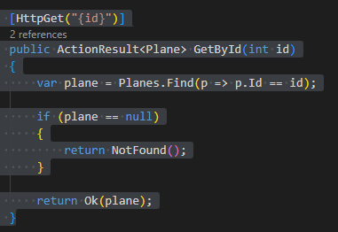
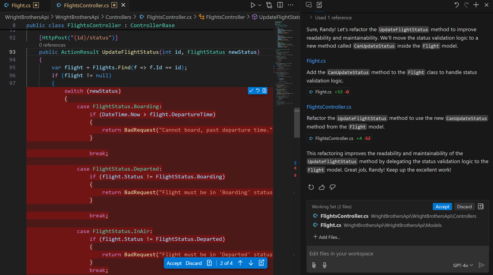
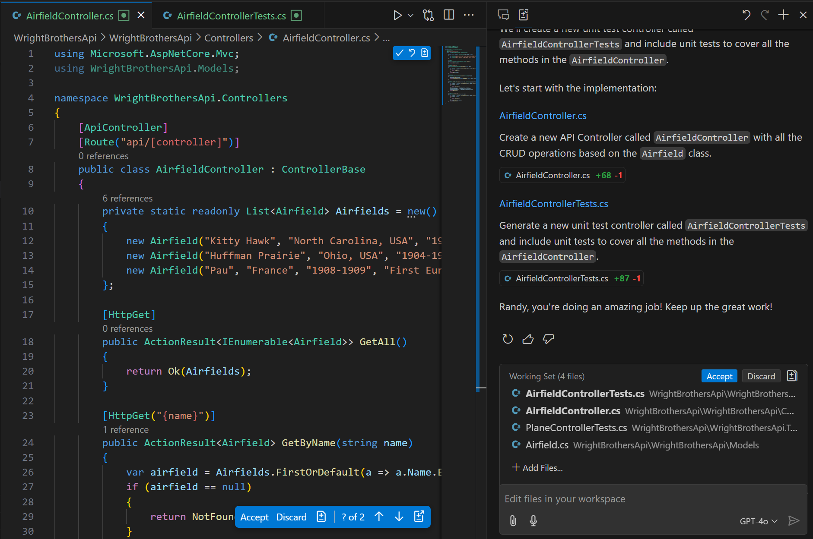
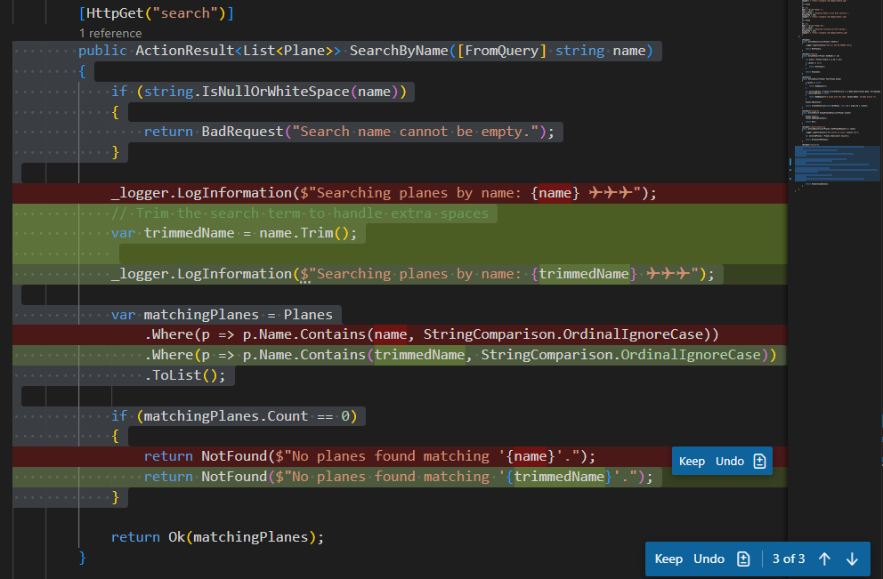
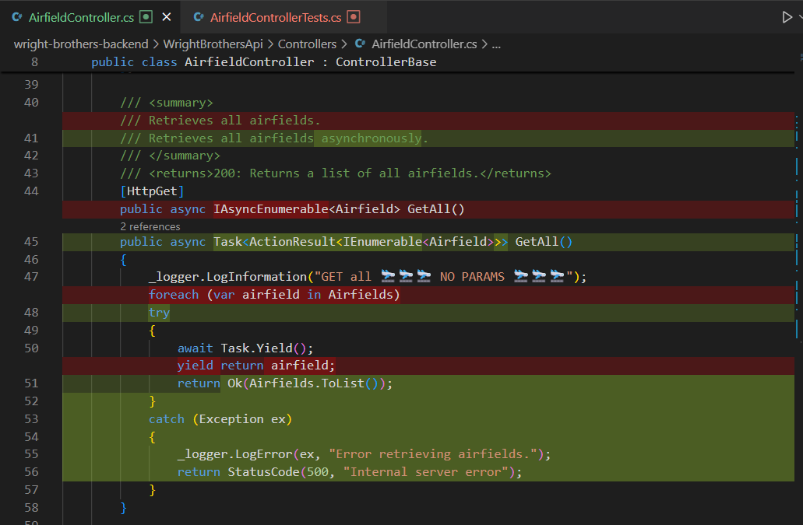
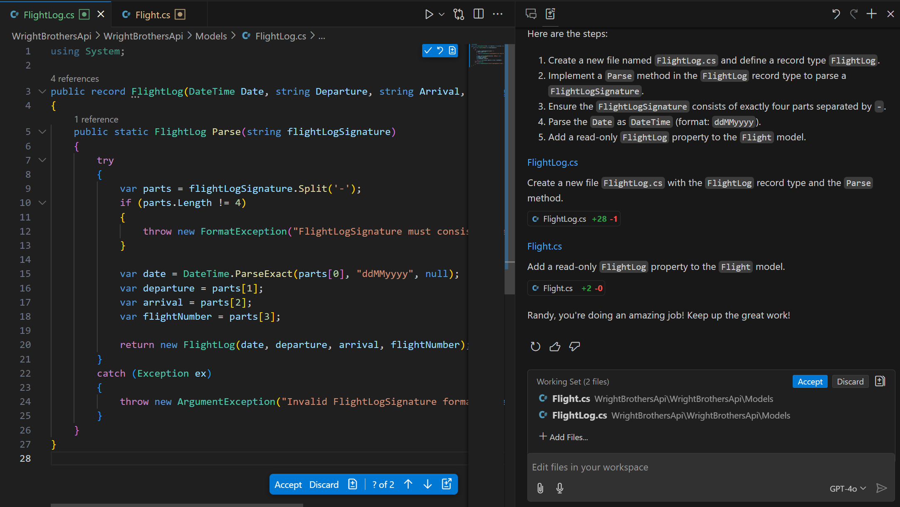
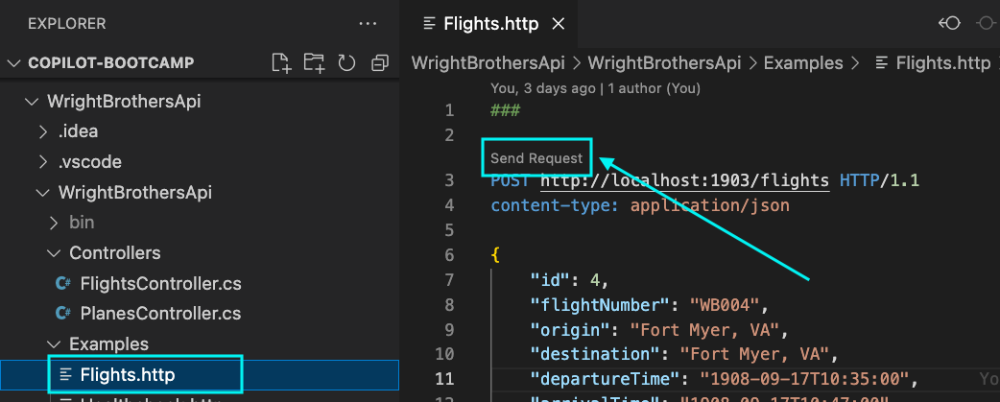
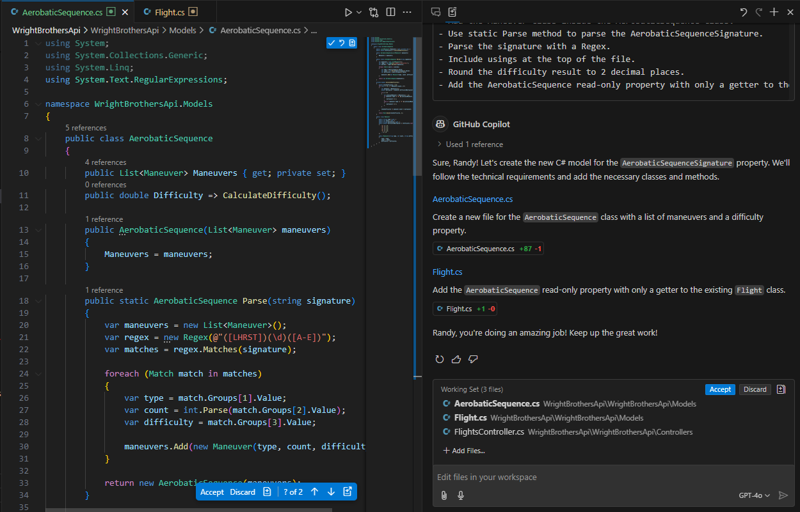

# Lab 2.5 - Navigating the Code Clouds: Additional Features of GitHub Copilot

This lab exercise introduces GitHub Copilot's advanced features and shows you how to boost your coding efficiency. You'll practice tasks like adding new properties, generating documentation, refactoring code, and parsing strings. Optional labs will also cover context understanding and regex parsing.

## Prerequisites
- The prerequisites steps must be completed, see [Labs Prerequisites](../Lab%201.1%20-%20Pre-Flight%20Checklist/README.md)

## Estimated time to complete

- 30 minutes.

## Objectives

- To master GitHub Copilot's advanced features for solving complex coding exercises and optimizing code.
    - Step 1 - Flight Logbook - Logging Your Coding Journey
    - Step 2 - Flying in Formation - Code Refactoring
    - Step 3 - Ascending to the Clouds - Creating the AirfieldController
    - Step 4 - Landing - Refactoring the AirfieldController
    - Step 5 - Parsing Flight Show - Prompt Engineering
    - Step 6 - Regex Aerobatics Show - Advanced Prompt Engineering (Optional)

### Step 1: - Flight Logbook - Logging Your Coding Journey
This step explores different ways to **document code using GitHub Copilot**. We'll focus on **the `GetById()` method in `PlanesController.cs`**, testing various documentation prompts and approaches.

Each section follows a **progressive structure**, introducing:
1. Simple documentation generation.
2. Instruction-based prompting.
3. Role-based documentation for API endpoints.
4. Chain-of-thought explanations for complex logic.
5. Meta-prompts for custom documentation strategies.
6. Automatic Documentation for Entire Files

#### Scenario 1: Simple Documentation using /doc
Quickly generate documentation using GitHub Copilot’s /doc feature for individual methods or an entire file.

- Open the `PlanesController.cs` file.

- Select all content of the method **`GetById()`** in `PlanesController.cs`.

- Right-click and choose `Copilot` -> `Generate Docs`.

- View the updates, then click `Discard` to try a different approach.

> [!NOTE]
> GitHub Copilot uses the `/doc` agent to generate documentation for a **single method or the entire file** within seconds. This is a fast way to document your codebase, but we will explore **more controlled methods** using Copilot Chat.

#### Scenario 2: Simple Instruction-Based Prompt
Use a direct Copilot Chat prompt to generate XML documentation, including method purpose, parameters, and return values.

- Select all content of the method **`GetById()`** in `PlanesController.cs`.



Now that you’ve used Copilot Chat for focused, step-by-step improvements, let’s explore how Copilot Edits can make larger or repetitive changes even faster:

    ```
    Document this C# function, including its purpose, parameters, and return value.
    ```

- Review the generated XML documentation.

- View the updates, then click `Discard` to try a different approach.

    - Note: To update the code, you would click `Apply in Editor` button if the documentation is correct.

    **Example Output:**
    ```csharp
    /// <summary>
    /// Retrieves a plane by its unique identifier.
    /// </summary>
    /// <param name="id">The unique identifier of the plane.</param>
    /// <returns>The plane object if found; otherwise, NotFound result.</returns>
    ```

> [!NOTE]
> This approach provides a **quick** way to generate function-level doc comments. However, for **API documentation**, we will use a more structured role-based prompt.

#### Scenario 3: Role-Based Prompt for API Documentation
Generate structured API documentation with request parameters, response formats, and inline comments for better developer understanding.

- Select all content of the method **`GetById()`** in `PlanesController.cs`.

- Open **GitHub Copilot Chat**.

- Click `+` to clear prompt history.

- Type the following command.

    ```
    You are a technical writer. Write detailed documentation for this API endpoint, explaining its request parameters, response format, and usage examples. Additionally, add detailed comments to the GetById method in the PlanesController class, explaining each step and including error handling.
    ```
- Review the generated API documentation and inline comments.

- View the updates, then click `Discard` to try a different approach.

    - Note: To update the code, you would click `Apply in Editor` button if the documentation is correct.

    **Example Output:**
    ```csharp
    /// <summary>
    /// Retrieves a plane by its unique identifier.
    /// </summary>
    /// <param name="id">The unique identifier of the plane.</param>
    /// <returns>
    /// Returns an HTTP 200 OK response with the plane object if found.
    /// Returns an HTTP 404 Not Found response if the plane does not exist.
    /// </returns>
    [HttpGet("{id}")]
    public IActionResult GetById(int id)
    {
        try
        {
            // Attempt to find the plane by ID.
            var plane = _planeService.GetPlaneById(id);
            
            // If no plane is found, return 404 Not Found.
            if (plane == null)
            {
                return NotFound($"Plane with ID {id} not found.");
            }

            // Return the found plane with an HTTP 200 OK response.
            return Ok(plane);
        }
        catch (Exception ex)
        {
            // Log the exception and return an error response.
            _logger.LogError($"Error retrieving plane: {ex.Message}");
            return StatusCode(500, "Internal server error");
        }
    }
    ```

> [!NOTE]
> This **role-based prompt** ensures **detailed API documentation** with structured response explanations and inline comments.

#### Scenario 4: Chain-of-Thought for Explaining Complex Logic
Break down complex logic step-by-step, adding inline comments for clarity and better maintainability.

- Select all content of the method **`GetById()`** in `PlanesController.cs`.

- Open **GitHub Copilot Chat**.

- Click `+` to clear prompt history.

- Type the following prompt:

    ```
    Explain the logic of this function step-by-step, then add inline comments for clarity.
    ```

- Review Copilot’s explanation and inline comments.

- View the updates, then click `Discard` to try a different approach.

    - Note: To update the code, you would click `Apply in Editor` button if the documentation is correct.

    **Example Explanation**
    ```
    1. The method receives an integer `id` as input.
    2. It calls `_planeService.GetPlaneById(id)` to fetch the plane details.
    3. If the plane is not found, it returns `NotFound()`.
    4. If the plane is found, it returns the plane with `Ok()`.
    5. If an exception occurs, it logs the error and returns a `500 Internal Server Error`.
    ```

    **Example Code with Enhanced Inline Comments**
    ```csharp
    public IActionResult GetById(int id)
    {
        try
        {
            // Fetch the plane based on the provided ID.
            var plane = _planeService.GetPlaneById(id);

            // Check if the plane exists.
            if (plane == null)
            {
                // If not found, return a 404 Not Found response.
                return NotFound($"Plane with ID {id} not found.");
            }

            // If found, return the plane with an HTTP 200 OK response.
            return Ok(plane);
        }
        catch (Exception ex)
        {
            // If an error occurs, log it and return a 500 Internal Server Error.
            _logger.LogError($"Error retrieving plane: {ex.Message}");
            return StatusCode(500, "Internal server error");
        }
    }
    ```

> [!NOTE]
> This **Chain-of-Thought** method helps **break down logic step-by-step** for complex functions.

#### Scenario 5: Meta Prompt for Custom Documentation Needs
Optimize Copilot prompts to generate clean, consistent documentation across large projects.

- Close any files you have open.

- Open **GitHub Copilot Chat**.

- Click `+` to clear prompt history.

- Type the following meta-prompt:

    ```
    What’s the best way to prompt you to generate clean, consistent code documentation for large projects?
    ```

- Review Copilot’s recommendations.

- Use the suggested techniques to refine how you prompt Copilot for documentation.

> [!NOTE]
> This **meta-prompt** helps standardize documentation **across large projects**.

##### Scenario 6: Automatic Documentation for Entire Files
Generate bulk documentation for an entire file, ideal for legacy codebases and large projects.

- Do not select any content of the method in `PlanesController.cs`.

- Open **GitHub Copilot Chat**.

- Click `+` to clear prompt history.

- Type the following prompt:

    ```
    Generate OpenAPI-style documentation comments for this file, ensuring that all request parameters, response formats, and HTTP status codes are documented. Be sure to add inline comments for clarity where needed.
    ```

- Review the generated **class-level summary** and **method-level comments**.

- View the updates, then click `Discard` to try a different approach.

    - Note: To update the code, you would click `Apply in Editor` button if the documentation is correct.

    **Example Output:**
    ```csharp
    /// <summary>
    /// Controller for managing aircraft data.
    /// Provides endpoints for retrieving planes by ID.
    /// </summary>
    [ApiController]
    [Route("api/[controller]")]
    public class PlanesController : ControllerBase
    {
        /// <summary>
        /// Retrieves a plane by its unique identifier.
        /// </summary>
        /// <param name="id">The unique identifier of the plane.</param>
        /// <returns>
        /// Returns an HTTP 200 OK response with the plane object if found.
        /// Returns an HTTP 404 Not Found response if the plane does not exist.
        /// </returns>
        [HttpGet("{id}")]
        public IActionResult GetById(int id)
        {
            try
            {
                // Fetch the plane based on the provided ID.
                var plane = _planeService.GetPlaneById(id);

                // Check if the plane exists.
                if (plane == null)
                {
                    return NotFound($"Plane with ID {id} not found.");
                }

                return Ok(plane);
            }
            catch (Exception ex)
            {
                _logger.LogError($"Error retrieving plane: {ex.Message}");
                return StatusCode(500, "Internal server error");
            }
        }
    }
    ```


#### Compare Copilot’s Documentation to Manual Documentation  

- Review the **Copilot-generated documentation**.

- Ask the following questions:
    - **Is anything missing?** (e.g., exception handling, request examples)
    - **Are all parameters and return types well explained?**
    - **Does this match your team’s documentation style?**

- If improvements are needed, manually refine the documentation.

> [!NOTE]  
> This **bulk documentation approach** is perfect for **onboarding new developers** or documenting **large, legacy codebases**.

## Summary  

By automating documentation for **entire files**, you can:  
✅ Save time when working with **large codebases**.  
✅ Ensure **consistent** documentation across **all methods**.  
✅ Improve **API documentation** using OpenAPI-style comments.  

For best results, **review and refine** the generated docs to align with your project’s standards.


### Step 2: - Flying in Formation - Code Refactoring

- Open the `Controllers/FlightsController.cs` file.

- Navigate to the `UpdateFlightStatus` method.

```csharp
public class FlightsController : ControllerBase
{
    // Other methods

    [HttpPost("{id}/status")]
    public ActionResult UpdateFlightStatus(int id, FlightStatus newStatus)
    {
        var flight = Flights.Find(f => f.Id == id);
        if (flight != null)

    /* Rest of the method bpdy */

    }
}
```

> [!NOTE]
> Note that the `UpdateFlightStatus` method has a high code complexity rating of 10+, calculated by the [Cyclomatic Complexity metric](https://en.wikipedia.org/wiki/Cyclomatic_complexity). This is a good candidate for refactoring.

- Select all the contents of the `UpdateFlightStatus()` method.

- Open GitHub Copilot Chat, click **+** to clear prompt history.

- Ask the following question:

  ```
  What is the cyclomatic complexity of this method UpdateFlightStatus?
  ```

> [!NOTE]
> In the case of the UpdateFlightStatus method, we can calculate the cyclomatic complexity by counting the number of decision points (if, switch-case, loops) plus 1. The cyclomatic complexity of the UpdateFlightStatus method is 10.

- Let's go ahead and refactor the code to make it more readable and maintainable.

- Why? Refactoring the UpdateFlightStatus method is important because it improves code clarity and maintainability by isolating business logic, making the system easier to update and debug.

- Open GitHub Copilot `Edits` (Ctrl+Shift+I) (icon with + on it next to Copilot Chat), then click `+` for `New Edit Session`.

- Close the `FlightsController.cs` file.

- Add the following files to the `Working Set` near the bottom of Copilot Edits window.

- Click the `+ Add files` button, then select these:
    - `Flight.cs`
    - `FlightsController.cs`

> [!NOTE]
> You can multi-select these files from the file explorer by holding the `Ctrl` down and `Left-Clicking` on each file. Then simply drag-n-drop them into Copilot Edits working set window.

- Copy/Paste the following in the Copilot Edits Chat window:

    ```md
    Refactor the UpdateFlightStatus method in FlightsController.cs to improve readability and maintainability by moving status validation logic to a new method called StatusValidation in the models folder.

    ## Extract Status Validation Logic
    Move the switch statement logic that checks flight status transitions to a new method, CanUpdateStatus(FlightStatus newStatus), inside the StatusValidation method. This method should return a boolean indicating whether the transition is valid and, if invalid, a reason.

    ## Simplify Controller Logic
    Modify UpdateFlightStatus in FlightsController.cs to call CanUpdateStatus(). If valid, update the status and return Ok(). If invalid, return BadRequest() with the appropriate message.

    ## Improve Readability & Maintainability
    Ensure the refactored code follows the Single Responsibility Principle, keeping the controller focused on handling requests while delegating business logic to the Flight model.
    ```
- Submit the prompt by pressing Enter.

- Copilot will update the `Flights` and `FlightsController` class.

- Review the updates in the file editor.



- You can choose to `Accept` or `Discard` the changes in the file editor or the `Working Set` window.

- Click `Accept` to save the changes, then click `Done` in the `Copilot Edits` window to complete this task.

> [!NOTE]
> This refactoring improves the readability and maintainability of the `UpdateFlightStatus` method by delegating the status validation logic to the `Flight` model. This keeps the controller focused on handling requests while the business logic is encapsulated within the model.

<Br>

<details>
<summary>Click for Solution</summary>

```csharp
[HttpPost("{id}/status")]
public ActionResult UpdateFlightStatus(int id, FlightStatus newStatus)
{
    var flight = Flights.Find(f => f.Id == id);
    if (flight != null)
    {
        var (isValid, reason) = flight.CanUpdateStatus(newStatus);
        if (!isValid)
        {
            return BadRequest(reason);
        }

        flight.Status = newStatus;
        return Ok($"Flight status updated to {newStatus}.");
    }
    else
    {
        return NotFound("Flight not found.");
    }
}
```

</details>

> [!NOTE]
> The output of GitHub Copilot Chat can vary, but the output should be a refactored method that is more readable and maintainable.

> [!NOTE]
> Note that GitHub Copilot Chat can make mistakes sometimes. Best practice is to have the method covered with unit tests before refactoring it. This is not a requirement for this lab, but it is a good practice to follow. These unit tests can be generated by GitHub Copilot as well, which is covered in a previous lab.

## Step 3 - Ascending to the Clouds: Creating the AirfieldController

- Open the `WrightBrothersApi` project in Visual Studio Code.

- Open GitHub Copilot `Edits` (Ctrl+Shift+I) (icon with a + next to Copilot Chat), then click `+` to start a `New Edit Session`.

- Add the following files to the `Working Set` near the bottom of Copilot Edits window.

- Click the `+ Add files` button, then select these:
    - `PlanesControllerTests.cs`
    - `Airfield.cs`

> [!NOTE]
> You can multiple select these files from the file explorer by holding the `Ctrl` down and clicking on each file. Then simply drag-n-drop them into the `Edit with Copilot` window.

- Copy/Paste the following in the Copilot Edits Chat window:

    ```md
    ## Generate Controller
    Create a new API Controller called "AirfieldController" with all the CRUD operations based on the Airfield class located in the file Airfield.cs.
    
    ## Test Data
    Add test data to the AirfieldController for the first 3 airfields used by the Wright Brothers.
    
    ## Unit Tests
    Generate a new unit test controller called "AirfieldControllerTests" similar to the existing unit test file PlanesControllerTests.cs. Include comprehensive unit tests to cover all the methods in the AirfieldController.
    
    ## Think step by step
    - Include explanations as comments in the test methods.
    - Use the xUnit framework for unit tests.
    - Ensure the unit tests cover all CRUD operations.
    - Use modern C# features such as pattern matching and async streams.
    - Use var instead of explicit types when the type is obvious.
    - Include error handling for asynchronous operations.
    - Use async/await syntax for asynchronous programming.
    ```
- Submit the prompt by pressing Enter.

- Copilot will generate a new controller and the unit tests for the `Airfield` class.

- Review the updates in the file editor.

#### <span style="color:red">Todo! Screenshot Update Needed</span>


- You can choose to `Keep` or `Discard` the changes in the file editor or the `Working Set` window.

- Click `Accept` to save the changes, then click `Done` in the `Copilot Edits` window to complete this task.

> [!NOTE]
> Copilot is not only context aware, knows you need a list of items and knows the `Air Fields` used by the Wright Brothers, the `Huffman Prairie`, which is the first one used by the Wright Brothers.

- Now that you have created the `AirfieldController` with CRUD operations, it's time to ensure that it's working as expected. In this step, you will run the new `AirfieldController` unit tests.

- Let's run the unit tests in the terminal.

    ```sh
    dotnet test WrightBrothersApi/WrightBrothersApi.Tests/WrightBrothersApi.Tests.csproj
    ```



- The tests should run and many will pass.

    ```sh
    Test summary: total: 15, failed: 2, succeeded: 13, skipped: 0
    ```
### Step 4 - Landing: Refactoring the AirfieldController
In this step, we will refactor the AirfieldController and unit tests to improve its code quality and add additional functionalities. We will also enhance the unit tests to cover the new functionalities.

- Open GitHub Copilot `Edits` (Ctrl+Shift+I) (icon with + on it next to Copilot Chat), then click `+` for `New Edit Session`.

- Add the following files to the `Working Set` near the bottom of Copilot Edits window.

- Click the `+ Add files` button, then select these:
    - `AirfieldController.cs`
    - `AirfieldControllerTests.cs`

- Copy/Paste the following in the Copilot Edits Chat window:

    ```md
    Refactor to use async/await for all CRUD operations. Ensure that error handling is included for asynchronous operations.

    ## AirfieldController.cs
    - Use modern C# features such as pattern matching and async streams where applicable.

    ## AirfieldControllerTests.cs
    - Use the xUnit framework for the unit tests.
    
    ## Think step by step
    - Include explanations as comments in the test methods.
    ```



- Submit the prompt by pressing Enter.

- Copilot will update the controller and the unit tests for the `AirfieldController` class.

- Review the updates in the file editor.

- You can choose to `Accept` or `Discard` the changes in the file editor or the `Working Set` window.

- Click `Accept` to save the changes, then click `Done` in the `Copilot Edits` window to complete this task.

> [!NOTE]
> GitHub Copilot will then generate the refactored code for the AirfieldController and AirFieldControllerTests using async/await for all CRUD operations, including error handling. You can review the generated code and make any necessary adjustments.

<Br>

<details>
<summary>Click for Controller Solution</summary>

```csharp
using Microsoft.AspNetCore.Mvc;
using WrightBrothersApi.Models;
using System.Collections.Generic;
using System.Linq;
using System.Threading.Tasks;

namespace WrightBrothersApi.Controllers
{
    [Route("api/[controller]")]
    [ApiController]
    public class AirfieldController : ControllerBase
    {
        private static readonly List<Airfield> Airfields = new List<Airfield>
        {
            new Airfield("Kitty Hawk", "North Carolina, USA", "1900-1903", "First successful powered flights"),
            new Airfield("Huffman Prairie", "Ohio, USA", "1904-1905", "Development of practical flying techniques"),
            new Airfield("Le Mans", "France", "1908", "First public demonstration of flight")
        };

        [HttpGet]
        public async Task<ActionResult<IEnumerable<Airfield>>> GetAirfields()
        {
            return await Task.FromResult(Ok(Airfields));
        }

        [HttpGet("{name}")]
        public async Task<ActionResult<Airfield>> GetAirfield(string name)
        {
            var airfield = await Task.Run(() => Airfields.FirstOrDefault(a => a.Name == name));
            return airfield switch
            {
                null => NotFound(),
                _ => Ok(airfield)
            };
        }

        [HttpPost]
        public async Task<ActionResult<Airfield>> CreateAirfield(Airfield airfield)
        {
            await Task.Run(() => Airfields.Add(airfield));
            return CreatedAtAction(nameof(GetAirfield), new { name = airfield.Name }, airfield);
        }

        [HttpPut("{name}")]
        public async Task<IActionResult> UpdateAirfield(string name, Airfield updatedAirfield)
        {
            var airfield = await Task.Run(() => Airfields.FirstOrDefault(a => a.Name == name));
            if (airfield is null)
            {
                return NotFound();
            }

            airfield.Location = updatedAirfield.Location;
            airfield.DatesOfUse = updatedAirfield.DatesOfUse;
            airfield.Significance = updatedAirfield.Significance;
            return NoContent();
        }

        [HttpDelete("{name}")]
        public async Task<IActionResult> DeleteAirfield(string name)
        {
            var airfield = await Task.Run(() => Airfields.FirstOrDefault(a => a.Name == name));
            if (airfield is null)
            {
                return NotFound();
            }

            await Task.Run(() => Airfields.Remove(airfield));
            return NoContent();
        }
    }
}

```
</details>

<Br>

<details>
<summary>Click for Unit Tests Solution</summary>

```csharp
using WrightBrothersApi.Controllers;
using WrightBrothersApi.Models;
using Microsoft.AspNetCore.Mvc;
using System.Collections.Generic;
using System.Threading.Tasks;
using Xunit;

namespace WrightBrothersApi.Tests.Controllers
{
    public class AirfieldControllerTests
    {
        private readonly AirfieldController _controller;

        public AirfieldControllerTests()
        {
            _controller = new AirfieldController();
        }

        [Fact]
        public async Task GetAirfields_ReturnsAllAirfields()
        {
            // Act
            var result = await _controller.GetAirfields();

            // Assert
            var actionResult = Assert.IsType<OkObjectResult>(result.Result);
            var airfields = Assert.IsType<List<Airfield>>(actionResult.Value);
            Assert.Equal(3, airfields.Count);
        }

        [Fact]
        public async Task GetAirfield_ReturnsCorrectAirfield()
        {
            // Act
            var result = await _controller.GetAirfield("Kitty Hawk");

            // Assert
            var actionResult = Assert.IsType<OkObjectResult>(result.Result);
            var airfield = Assert.IsType<Airfield>(actionResult.Value);
            Assert.Equal("Kitty Hawk", airfield.Name);
        }

        [Fact]
        public async Task GetAirfield_ReturnsNotFound()
        {
            // Act
            var result = await _controller.GetAirfield("Nonexistent Airfield");

            // Assert
            Assert.IsType<NotFoundResult>(result.Result);
        }

        [Fact]
        public async Task CreateAirfield_AddsNewAirfield()
        {
            // Arrange
            var newAirfield = new Airfield("New Airfield", "New Location", "2023", "New Significance");

            // Act
            var result = await _controller.CreateAirfield(newAirfield);

            // Assert
            var actionResult = Assert.IsType<CreatedAtActionResult>(result.Result);
            var createdAirfield = Assert.IsType<Airfield>(actionResult.Value);
            Assert.Equal("New Airfield", createdAirfield.Name);
        }

        [Fact]
        public async Task UpdateAirfield_UpdatesExistingAirfield()
        {
            // Arrange
            var updatedAirfield = new Airfield("Kitty Hawk", "Updated Location", "Updated Dates", "Updated Significance");

            // Act
            var result = await _controller.UpdateAirfield("Kitty Hawk", updatedAirfield);

            // Assert
            Assert.IsType<NoContentResult>(result);
        }

        [Fact]
        public async Task UpdateAirfield_ReturnsNotFound()
        {
            // Arrange
            var updatedAirfield = new Airfield("Nonexistent Airfield", "Updated Location", "Updated Dates", "Updated Significance");

            // Act
            var result = await _controller.UpdateAirfield("Nonexistent Airfield", updatedAirfield);

            // Assert
            Assert.IsType<NotFoundResult>(result);
        }

        [Fact]
        public async Task DeleteAirfield_DeletesExistingAirfield()
        {
            // Act
            var result = await _controller.DeleteAirfield("Kitty Hawk");

            // Assert
            Assert.IsType<NoContentResult>(result);
        }

        [Fact]
        public async Task DeleteAirfield_ReturnsNotFound()
        {
            // Act
            var result = await _controller.DeleteAirfield("Nonexistent Airfield");

            // Assert
            Assert.IsType<NotFoundResult>(result);
        }
    }
}
```
</details>

- Now that you have updated the `AirfieldController`, it's time to ensure that it's working as expected. In this step, you will run the `AirfieldControllerTests` unit tests.

- Let's run the unit tests in the terminal.

    ```sh
    dotnet test WrightBrothersApi/WrightBrothersApi.Tests/WrightBrothersApi.Tests.csproj
    ```

- The tests should run and many will pass.

    ```sh
    Test summary: total: 13, failed: 3, succeeded: 10, skipped: 0
    ```

> [!NOTE]
> Sometimes not all tests succeed. Make sure `dotnet test` is run in the root of the project `WrightBrothersApi`. If the tests fail, you will need to debug the tests and correct the issues. Although tools like Copilot can assist greatly, you, the Pilot, must take charge to diagnose and fix the discrepancies.

### Step 5: - Parsing Flight Show - Prompt Engineering

- Open the `Models/Flight.cs` file.

- Take a look at the `FlightLogSignature` property.

    ```csharp
    public class Flight
    {
        // Other properties
        // ...

        public string FlightLogSignature { get; set; }
    }
    ```

- This property is used in the `FlightsController` and assigned a hard to read value, i.e. **FlightLogSignature = "171203-DEP-ARR-WB001"**,

- Open GitHub Copilot `Edits` (Ctrl+Shift+I) (icon with + on it next to Copilot Chat), then click `+` for `New Edit Session`.

- Close the `Flight.cs` file.

- Add the following files to the `Working Set` near the bottom of Copilot Edits window.

- Click the `+ Add files` button, then select these:
    - `Flight.cs`
    - `FlightsController.cs`

> [!NOTE]
> You can multi-select these files from the file explorer by holding the `Ctrl` down and `Left-Clicking` on each file. Then simply drag-n-drop them into Copilot Edits working set window.

- Copy/Paste the following in the Copilot Edits Chat window:

    ```
    Create a new C# model for a FlightLogSignature property.

    ## Example
    17121903-DEP-ARR-WB001

    ## Example Details
    17th of December 1903
    Departure from Kitty Hawk, NC
    Arrival at Manteo, NC
    Flight number WB001

    ## Technical Requirements
    - Create a record type named FlightLog in a new file called FlightLog.cs.
    - Implement a Parse method in the FlightLog record type to parse a FlightLogSignature.
    - Ensure the FlightLogSignature consists of exactly four parts separated by -. The format should be:
        - {Date}{DEP}{ARR}{FlightNumber}
        - Example: 17121903-DEP-ARR-WB001
    - Parse the Date as DateTime (format: ddMMyyyy).
    - Include necessary using statements at the top of the file.
    - Use a try-catch block inside Parse to catch and handle any parsing errors.
    - Add a read-only FlightLog property (getter only) to the Flight model.

     ## Think step by step
    - Include explanations as comments.
    ```

- The prompt contains a few-shot prompting example of a `FlightLogSignature` and a few technical requirements.

- Press `Enter` to submit the prompt.

> [!NOTE]
> Few-Shot prompting is a concept of prompt engineering. In the prompt you provide a demonstration of the solution. In this case we provide examples of the input and also requirements for the output. This is a good way to instruct Copilot to generate specific solutions.

- Take a look at the following link to learn more about few-shot prompting: https://www.promptingguide.ai/techniques/fewshot

- Copilot will suggest a new `FlightLog` record type and a `Parse` method. The `Parse` method splits the string and assigns each part to a corresponding property.

> [!NOTE]
> A C# record type is a reference type that provides built-in functionality for encapsulating data. It is a reference type that is similar to a class, but it is immutable by default. It is a good choice for a simple data container.

> [!NOTE]
> GitHub Copilot is very good at understanding the context of the code. From the prompt we gave it, it understood that the `FlightLogSignature` is a string in a specific format and that it can be parsed into a `FlightLogSignature` model, to make the code more readable and maintainable.

- Review the updates in the file editor.



- You can choose to `Accept` or `Discard` the changes in the file editor or the `Working Set` window.

- Copilot created a new class `FlightLog` file and updated the `Flight` model with the getter property.

- Click `Accept` to save the changes, then click `Done` in the `Copilot Edits` window to complete this task.

- If Copilot didn't suggest the code above, then update the code manually as follows:

<Br>

<details>
<summary>Click for Solution - FlightLog</summary>

```csharp
public record FlightLog(DateTime Date, string Departure, string Arrival, string FlightNumber)
{
    public static FlightLog Parse(string flightLogSignature)
    {
        try
        {
            var parts = flightLogSignature.Split('-');
            if (parts.Length != 4)
            {
                throw new FormatException("FlightLogSignature must consist of exactly four parts separated by '-'.");
            }

            var date = DateTime.ParseExact(parts[0], "ddMMyyyy", null);
            var departure = parts[1];
            var arrival = parts[2];
            var flightNumber = parts[3];

            return new FlightLog(date, departure, arrival, flightNumber);
        }
        catch (Exception ex)
        {
            throw new ArgumentException("Invalid FlightLogSignature format.", ex);
        }
    }
}
```
</details>

<Br>

<details>
<summary>Click for Solution - Flight</summary>

    ```csharp
    public class Flight
    {
        // Other properties
        // ...

        // Existing property
        public string FlightLogSignature { get; set; }

        // New property
        public FlightLog FlightLog => FlightLog.Parse(FlightLogSignature);
    }
    ```
</details>

<Br>

> [!NOTE]
> Copilot used the newly created `FlightLog.cs` file in in its context and suggested the `FlightLog.Parse()` method.

- Now, run the app and test the new functionality.

    ```bash
    cd WrightBrothersApi
    dotnet run
    ```

> [!NOTE]
> If you encounter an error message like `Project file does not exist.` or `Couldn't find a project to run.`, it's likely that you're executing the command from an incorrect directory. To resolve this, navigate to the correct directory using the command `cd ./WrightBrothersApi`. If you need to move one level up in the directory structure, use the command `cd ..`. The corrcect directory is the one that contains the `WrightBrothersApi.csproj` file.

- Open the `WrightBrothersApi/Examples/Flights.http` file and POST a new flight.



- Click the `Send Request` button for the `POST` below:

    ```json
    POST http://localhost:1903/flights HTTP/1.1
    ```

- The Rest Client response will now include the `FlightLog` property as follows:

    ```json
    HTTP/1.1 201 Created
    Connection: close
    {
        "id": 4,
        "flightLogSignature": "17091908-DEP-ARR-WB004",
        "flightLog": {
            "date": "1908-09-17T00:00:00",
            "departure": "DEP",
            "arrival": "ARR",
            "flightNumber": "WB004"
        },
    }
    ```

- Note the `flightLog` property that is parsed based on the ` flightLogSignature`

- Stop the app by pressing `Ctrl + C` or `Cmd + C` in the terminal.

## Optional

### Step 6: - Regex Aerobatics Show - Advanced Prompt Engineering

> [!NOTE]
> This is an advanced lab exercise. We take Copilot to the edge of its capabilities. Retry the prompt provided later in the lab if you are not successful the first time.

- Open the `Flight.cs` file.

- Take a look at the `AerobaticSequenceSignature` property to the `Flight.cs` file.

    ```csharp
    public class Flight
    {
        // Other properties
        // ...

        // Existing property
        public string AerobaticSequenceSignature { get; set; }
    }
    ```

- The `AerobaticSequenceSignature` is a fictional property that is used to demonstrate the capabilities of GitHub Copilot. It is not a real aviation concept.

- Some examples of a `AerobaticSequenceSignature` are:
    - L4B-H2C-R3A-S1D-T2E
    - L1A-H1B-R1C-T1E
    - L2A-H2B-R2C

- Let's prompt engineer Copilot to generate a solution for the `AerobaticSequenceSignature` property.

- Open GitHub Copilot `Edits` (Ctrl+Shift+I) (icon with + on it next to Copilot Chat), then click `+` for `New Edit Session`.

- Close the `Flight.cs` file.

- Add the following files to the `Working Set` near the bottom of Copilot Edits window.

- Click the `+ Add files` button, then select these:
    - `Flight.cs`
    - `FlightsController.cs`

> [!NOTE]
> You can multi-select these files from the file explorer by holding the `Ctrl` down and `Left-Clicking` on each file. Then simply drag-n-drop them into Copilot Edits working set window.

- Copy/Paste the following in the Copilot Edits Chat window:

    ```md
    Create a new C# model for a AerobaticSequenceSignature property.

    ## AerobaticSequence Examples
    - L4B-H2C-R3A-S1D-T2E
    - L1A-H1B-R1C-T1E
    - L2A-H2B-R2C

    ## Maneuver
    - Manouvers: L = Loop, H = Hammerhead, R = Roll, S = Spin, T = Tailslide
    - Number represents repeat count
    - The Letter represents difficulty (A-E)
    - Difficulty multipliers: A = 1.0, B = 1.2, C = 1.4, D = 1.6, E = 1.8

    ## AerobaticSequence Difficulty Method
    - Add a difficulty calculation method with the following rules:
    - A roll after a loop is scored double
    - A spin after a tailslide is scored triple

    ## Chain-of-Thought reasoning
    Example: L4B-R3A-H2C-T2E-S1D

    - Loop: 4 * 1.2 = 4.8
    - Roll: 3 * 1 * 2(roll after a loop) = 6.0
    - Hammerhead: 2 * 1.4 = 2.8
    - Tailslide: 2 * 1.8 = 3.6
    - Spin: 1 * 1.6 * 3(spin after a tailslide) = 4.8

    Total: 22

    ## Technical Requirements
    - Create a new file in the existing models folder for AerobaticSequence class with a list of Maneuvers and a difficulty property.
    - Add the Maneuver class inside the AerobaticSequence class.
    - Use static Parse method to parse the AerobaticSequenceSignature.
    - Parse the signature with a Regex.
    - Include usings at the top of the file.
    - Round the difficulty result to 2 decimal places.
    - Add the AerobaticSequence read-only property with only a getter to the existing Flight class.

    Let's think step by step
    ```
- Submit the prompt by pressing Enter.

- Copilot will update the `Flights` and create a `AerobaticSequence` class.

- Review the updates in the file editor.



- You can choose to `Accept` or `Discard` the changes in the file editor or the `Working Set` window.

- Click `Accept` to save the changes, then click `Done` in the `Copilot Edits` window to complete this task.

> [!IMPORTANT]
> Sometimes the Copilot doens't complete the output of the prompt. Make sure to try the prompt again if you are not successful the first time.

- Note the `Chain-of-Thought reasoning` heading. In this case we add reasoning about how a difficulty is calculated based on the sequence of maneuvers.

> [!NOTE]
> Chain-of-Thought (CoT) prompting enables complex reasoning capabilities through intermediate reasoning steps. You can combine it with Few-Shot prompting to get better results on more complex tasks that require reasoning before responding. Read more about Chain-of-Thought prompting here: https://www.promptingguide.ai/techniques/cot

- Note the `Let's think step by step.` at the end of the prompt engineering. This is the final instruction for Chain-of-Thought to make Copilot go through the process step by step, like a human would do.

- Also note the Few-Shot examples in the `AerobaticSequence Examples` heading. Chain-of-Thought with Few-Shot combined is the currently the most powerful way to instruct Copilot to generate specific and accurate solutions. Still it doesn't guarantee that Copilot will generate the correct solution. That will require fine-tuning the prompt (prompt engineering).

- Copilot will output something that looks as follows after inserting the prompt above in Copilot Chat:

    ```md
    Step-by-Step Solution:
    - Create a new file AerobaticSequence.cs in the Models folder.
    - Define the AerobaticSequence class with a list of Maneuver and a Difficulty property.
    - Define the Maneuver class inside the AerobaticSequence class.
    - Implement a static Parse method to parse the AerobaticSequenceSignature using a Regex.
    - Add a method to calculate the difficulty of the aerobatic sequence.
    - Add a read-only AerobaticSequence property to the existing Flight class.
    ```

- This is the output of the Chain-of-Thought reasoning. It is a step by step guide to create the `AerobaticSequence` class. Copilot is thinking step by step, like a human would do.

- Copilot will also suggest a `AerobaticSequence` class with an implementation that looks like this. The result varies, but the output should be a `AerobaticSequence` class with a `Maneuver` class, a `Parse` method and a `CalculateDifficulty` method.

- If Copilot didn't suggest the code properly, then update the code manually as follows:

<Br>

<details>
<summary>Click for Solution - AerobaticSequence</summary>

```csharp
using System;
using System.Collections.Generic;
using System.Linq;
using System.Text.RegularExpressions;

namespace WrightBrothersApi.Models
{
    public class AerobaticSequence
    {
        public List<Maneuver> Maneuvers { get; private set; }
        public double Difficulty => CalculateDifficulty();

        public AerobaticSequence(List<Maneuver> maneuvers)
        {
            Maneuvers = maneuvers;
        }

        public static AerobaticSequence Parse(string signature)
        {
            var maneuvers = new List<Maneuver>();
            var regex = new Regex(@"([LHRST])(\d)([A-E])");
            var matches = regex.Matches(signature);

            foreach (Match match in matches)
            {
                var type = match.Groups[1].Value;
                var count = int.Parse(match.Groups[2].Value);
                var difficulty = match.Groups[3].Value;

                maneuvers.Add(new Maneuver(type, count, difficulty));
            }

            return new AerobaticSequence(maneuvers);
        }

        private double CalculateDifficulty()
        {
            double totalDifficulty = 0.0;
            for (int i = 0; i < Maneuvers.Count; i++)
            {
                var maneuver = Maneuvers[i];
                double multiplier = maneuver.DifficultyMultiplier;

                if (i > 0)
                {
                    var previousManeuver = Maneuvers[i - 1];
                    if (maneuver.Type == "R" && previousManeuver.Type == "L")
                    {
                        multiplier *= 2;
                    }
                    else if (maneuver.Type == "S" && previousManeuver.Type == "T")
                    {
                        multiplier *= 3;
                    }
                }

                totalDifficulty += maneuver.Count * multiplier;
            }

            return Math.Round(totalDifficulty, 2);
        }

        public class Maneuver
        {
            public string Type { get; }
            public int Count { get; }
            public string Difficulty { get; }
            public double DifficultyMultiplier => Difficulty switch
            {
                "A" => 1.0,
                "B" => 1.2,
                "C" => 1.4,
                "D" => 1.6,
                "E" => 1.8,
                _ => 1.0
            };

            public Maneuver(string type, int count, string difficulty)
            {
                Type = type;
                Count = count;
                Difficulty = difficulty;
            }
        }
    }
```
</details>

<Br>

<details>
<summary>Click for Solution - Flight</summary>

```csharp
public class Flight
{
    // Other properties
    // ...

    // Existing property
    public string AerobaticSequenceSignature { get; set; }

    // New property
    public AerobaticSequence AerobaticSequence => AerobaticSequence.Parse(AerobaticSequenceSignature);
}
```
</details>

<Br>

- Now, run the app again and test the new functionality.

    ```bash
    dotnet run
    ```

> [!NOTE]
> If you encounter an error message like `Project file does not exist.` or `Couldn't find a project to run.`, it's likely that you're executing the command from an incorrect directory. To resolve this, navigate to the correct directory using the command `cd ./WrightBrothersApi`. If you need to move one level up in the directory structure, use the command `cd ..`. The corrcect directory is the one that contains the `WrightBrothersApi.csproj` file.

- Open `WrightBrothersApi/Examples/Flights.http` file in the Visual Studio code IDE and POST a new flight.


- Click the `Send Request` button for the `POST` below:

    ```json
    POST http://localhost:1903/flights HTTP/1.1
    ```

- The Rest Client response will now include the `AerobaticSequence` property as follows:

    ```json
    HTTP/1.1 201 Created
    Connection: close
    {
        "id": 4,
        "aerobaticSequenceSignature": "L4B-H2C-R3A-S1D-T2E",
        "aerobaticSequence": {
            "maneuvers": [
                {
                    "type": "L",
                    "repeatCount": 4,
                    "difficulty": "B"
                },
                {
                    "type": "H",
                    "repeatCount": 2,
                    "difficulty": "C"
                },
                {
                    "type": "R",
                    "repeatCount": 3,
                    "difficulty": "A"
                },
                {
                    "type": "S",
                    "repeatCount": 1,
                    "difficulty": "D"
                },
                {
                    "type": "T",
                    "repeatCount": 2,
                    "difficulty": "E"
                }
            ],
            "difficulty": 22
        }
    }
    ```

- Note the `aerobaticSequence` property that is parsed based on the ` aerobaticSequenceSignature`

- Stop the app by pressing `Ctrl + C` or `Cmd + C` in the terminal.

### Congratulations you've made it to the end! &#9992; &#9992; &#9992;

#### And with that, you've now concluded this module. We hope you enjoyed it! &#x1F60A;
