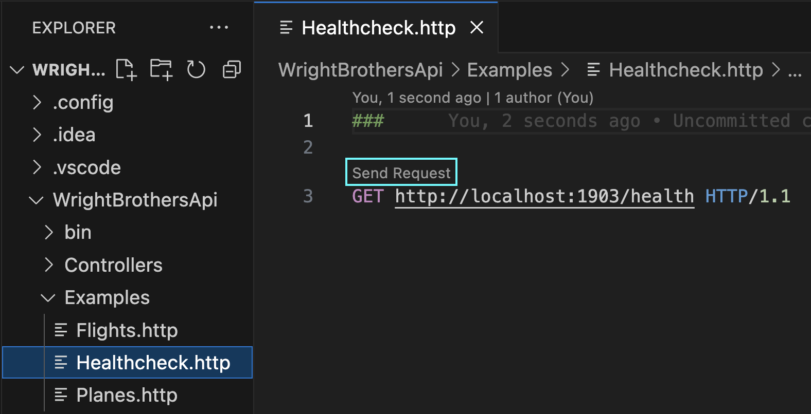
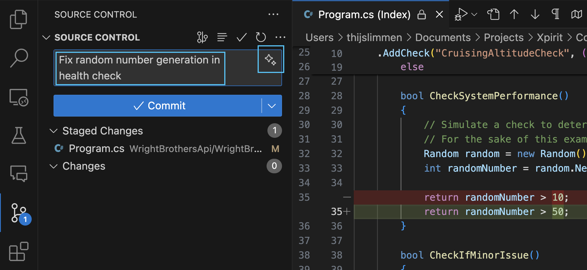
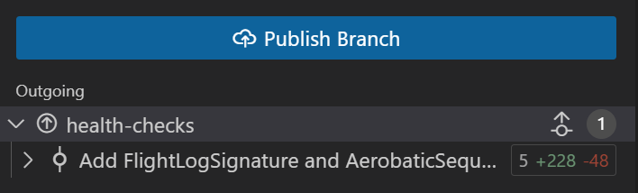

# Lab 3.3 - Auto-Pilot Mode ✈ AI Assistance in Software Development

In this lab, you’ll use GitHub Copilot to automate health checks, set up a CI/CD pipeline, provision and deploy to Azure with Infrastructure as Code, and use Copilot’s built-in PR summaries. Each step uses clear, conversational prompts and highlights Copilot’s strengths in a real .NET/Cloud workflow.

## Prerequisites
- The prerequisites steps must be completed, see [Labs Prerequisites](../Lab%201.1%20-%20Pre-Flight%20Checklist/README.md)

## Estimated time to complete

- 20 minutes

## Objectives

- Leverage GitHub Copilot for efficient .NET and DevOps workflows.
- Automate health checks, pipelines, and infrastructure provisioning with easy-to-follow prompts.
- Summarize code changes and PRs using Copilot for faster team communication.
    - Step 1 - Fasten your seatbelts, turbulence incoming - Committing Code Changes
    - Step 2 - Smooth Flying in the Cloud - Automating GitHub Pipelines
    - Step 3 - Ground Control - How to assent to the Azure Cloud
    - Step 4 - Flight Plan - Crafting a Detailed DevOps Pipeline with Bicep IaC
    - Step 5 - Turn on Autopilot Mode - Automating GitHub Pull Requests

### Step 1. Fasten your seatbelts, turbulence incoming - Committing Code Changes

- Open `Program.cs` in `WrightBrothersApi` folder

- Note the following code that adds a health check to the application. The healthcheck simulates a health check that sometimes is healthy, sometimes is degraded, and sometimes is unhealthy.

    ```csharp
    // Other code

    var builder = WebApplication.CreateBuilder(args);

    builder.Services.AddHealthChecks()
    .AddCheck("CruisingAltitudeCheck", () =>
    {
        bool atCruisingAltitude = CheckSystemPerformance();

        if (atCruisingAltitude)

        {
            return HealthCheckResult.Healthy("The application is cruising smoothly at optimal altitude.");
        }
        else
        {
            bool minorIssue = CheckIfMinorIssue();

            return minorIssue ?
                HealthCheckResult.Degraded("The application is experiencing turbulence but remains stable.") :
                HealthCheckResult.Unhealthy("The application is facing a system failure and needs immediate attention.");
        }

        bool CheckSystemPerformance()
        {
            // Simulate a check to determine if the application is "at cruising altitude"
            // For the sake of this example, we'll just return a random value
            Random random = new Random();
            int randomNumber = random.Next(1, 100);

            return randomNumber > 10;
        }

        bool CheckIfMinorIssue()
        {
            // Simulate a check to determine if the application is "at cruising altitude"
            // For the sake of this example, we'll just return a random value
            Random random = new Random();
            int randomNumber = random.Next(1, 100);

            return randomNumber > 50;
        }
    });

    // Other code
    ```

- Run the application to see the health check in action.

    ```sh
    cd WrightBrothersApi
    dotnet run
    ```

> [!NOTE]
> If you encounter an error message like `Project file does not exist.` or `Couldn't find a project to run.`, it's likely that you're executing the command from an incorrect directory. To resolve this, navigate to the correct directory using the command `cd ./WrightBrothersApi`. If you need to move one level up in the directory structure, use the command `cd ..`. The corrcect directory is the one that contains the `WrightBrothersApi.csproj` file.

- Open the `Examples/Healthcheck.http` file, click `Send Request` to execute the `health` request.



- Click the `Send Request` button for the `GET` below:

    ```json
    GET http://localhost:1903/health HTTP/1.1
    ```

- The response should be `200 OK` and show `"Healthy"`, `"Degraded"`, or `"Unhealthy"` with the following body:

    ```json
    {
        "status": "Healthy", // or "Degraded" or "Unhealthy"
        "totalDuration": "00:00:00.0000001"
    }
    ```

- Stop the application by pressing `Ctrl+C` in the terminal.

- Let's make a small change to the code.
- Change the `CheckSystemPerformance` method to return a random number greater than 50. This will simulate a more unstable system.

    ```csharp
    bool CheckSystemPerformance()
    {
        // Simulate a check to determine if the application is "at cruising altitude"
        // For the sake of this example, we'll just return a random value
        Random random = new Random();
        int randomNumber = random.Next(1, 100);

        return randomNumber > 50;
    }
    ```

- Create a new feature branch `feature/health-checks` from the `main` branch in your terminal and switch to it.

```sh
git checkout -b feature/health-checks
```

**Stage, commit, and push your changes:**

- Open the Source Control tab in VS Code

- Click on the `Magic` icon to generate a commit message

- In the `Changes` area, click the `+` icon to `Stage all changes`




> [!NOTE]
> GitHub Copilot Chat suggests a commit message based on the changes made to the code. This is a great way to get started with a commit message.

- Click the `✓ Commit` button commit the changes.

- Click the `Publish Branch` button to push the changes.



- Close the file `Program.cs`.

### Step 2. Smooth Flying in the Cloud - Automating GitHub Pipelines

A build pipeline automates your software's build, test, and deployment processes, ensuring consistent and error-free releases while saving time and improving code quality. It streamlines development, enables quick feedback, and supports efficient version management. Let's begin by
automating CI/CD pipelines for deployment to Azure.

- Open **GitHub Copilot Chat**.

- Click `+` to clear prompt history.

- Type the following prompt:

    ```
    Create a GitHub Actions build pipeline for this .NET solution that restores dependencies, builds, and runs tests.
    ```

> [!NOTE]
> If you see message `Workspace used /new (rerun without)`, click on the `Rerun without` button to continue.

- GitHub Copilot Chat will suggest creating a GitHub Actions build pipeline for the application. It also includes a build steps and a test steps.

- In GitHub Copilot Chat, click the ellipses `...` and select `Insert into New File` for the suggested pipeline.

- Copilot will add the code to a new empty file, but must be saved.

- Save the file by clicking pressing `Ctrl + S` or `Cmd + S`.

- Change directory to the `.github/workflows` folder`.

- Enter the file name `build.yaml` and click `Save`.

> [!NOTE]
> With the @workspace agent, GitHub Copilot understands that the current workspace is a .NET application with a Test project in it. It also understands that the application is hosted in a folder called `WrightBrothersApi` and the test project is in a folder called `WrightBrothersApi.Tests`. This is a great example of how GitHub Copilot can understand the context of the current workspace and provide suggestions based on that context.

### Step 3. Ground Control - How to assent to the Azure Cloud

Deploying your application to Azure facilitates scalable, secure, and efficient hosting, leveraging Microsoft's cloud infrastructure. This allows for easy scaling, robust disaster recovery, and global reach, enhancing your app's performance and accessibility while minimizing maintenance efforts and costs.

> [!WARNING]  
> You must complete the previous lab before continuing.

- Pre-requisite is a valid `build.yaml` build pipeline from previous step.

- With **GitHub Copilot Chat** open, type the following prompt:

    ```
    Generate a Bicep template to provision an Azure Web App for this .NET API project.
    ```

- In GitHub Copilot Chat, click the ellipses `...` and select `Insert into New File` for the suggested pipeline.

- Copilot will add the code to a new empty file, but must be saved.

- Save the file by clicking pressing `Ctrl + S` or `Cmd + S`.

- Enter the file name `Main.bicep` and click `Save` in the `.github/workflows` folder.

> [!NOTE]
> For the purpose of this lab, we are creating a simple Bicep file and saving in the `.github/workflows` folder. Its best practice to create a separate folder for infrastructure code and save the Bicep files there.

- Click on tab for `build.yaml` file to bring it to focus.

- With **GitHub Copilot Chat** open, type the following prompt:

   ```
   Update the build.yml pipeline to deploy the infrastructure using main.bicep and then deploy the application to the Azure Web App.
   ```

- GitHub Copilot Chat will suggest adding a deploy step to the pipeline, which is a Azure Web App deployment.

- Select all the content of the `build.yml`.

- In GitHub Copilot Chat, click the `Insert at Cursor` button to replace the build.yml file contents.

- Now the pipeline first builds the application, then deploys it to Azure.

- Open the Source Control tab in VS Code

- Click on the `Magic` icon to generate a commit message

- In the `Changes` area, click the `+` icon to `Stage all changes`

- Click the `✓ Commit` button commit the changes.

- Click the `Sync Changes` button to push the changes.


> [!IMPORTANT]
> GitHub Copilot Chat will suggest creating a Bicep files for the infrastructure. If Copilot suggested multiple files, save all of them accordingly.

- In this lab we have created a build pipeline that builds the application, runs the tests, and deploys the application to Azure. We have also created the infrastructure as code files using Bicep and added a step to the pipeline to deploy the infrastructure as code.

> [!NOTE]
> The results of Copilot might not be perfect, but it can be a great starting point for you to build upon. You are the pilot, you need to make sure the pipeline is correct.

### Step 4. Autopilot for Pull Requests – Copilot PR Summaries

Pull requests are a critical part of the development process, enabling collaboration, code review, and quality assurance. They help maintain code quality, ensure consistency, and facilitate knowledge sharing among team members. GitHub Copilot can assist in summarizing pull requests, making it easier to communicate changes and decisions effectively.

- Push your feature branch to GitHub.

- Navigate to your repo `home` or `code` tab in the browser.

- Create a PR by clicking `Compare & pull request` button.

- You will see a message `✓ Able to merge` for the changes merging from `feature/health-checks` to `main`.

- Above text box `Add a description`, click the `Copilot icon`  and select **Summary** to auto-generate a pull request summary.

- Under `Reviewers`, click **Copilot** as a reviewer to the PR.

- Review and use **Copilot’s summary** to document your changes.

- Click `Create pull request` to create the PR.

### Step 5. Advanced Flight Plan – Expand to Multi-Stage DevOps Pipeline

Take it further by creating a more advanced pipeline with clearly defined Build, Infrastructure as Code, and Quality Assurance stages.

- Close all open files in VS Code.

- Open **GitHub Copilot Chat**.

- Click `+` to clear prompt history.

- Type the following prompt:
   ```
   Create a multi-stage DevOps pipeline for .NET with Build, Bicep-based IaC deployment, and Quality Assurance stages. Scaffold all necessary YAML workflow files and explain each stage with comments.
   ```

> [!NOTE]
> If you see message `Workspace used /new (rerun without)`, click on the `Rerun without` button to continue.

- In GitHub Copilot Chat, click the ellipses `...` and select `Insert into New File` for the suggested pipeline.

- Copilot will add the code to a new empty file, but must be saved.

- Save the file by clicking pressing `Ctrl + S` or `Cmd + S`.

- Change directory to the `.github/workflows` folder`.

- Enter the file name `build-full.yml` and click `Save`.

- Open the Source Control tab in VS Code

- Click on the `Magic` icon to generate a commit message

- In the `Changes` area, click the `+` icon to `Stage all changes`

- Click the `✓ Commit` button commit the changes.

- Click the `Sync Changes` button to push the changes.


> [!NOTE]
> Creating a multi-stage pipeline can be complex, but GitHub Copilot can help you get started with the basic structure. You can then customize the pipeline to fit your specific needs.


### Congratulations you've made it to the end! &#9992; &#9992; &#9992;

#### And with that, you've now concluded this module. We hope you enjoyed it! &#x1F60A;
