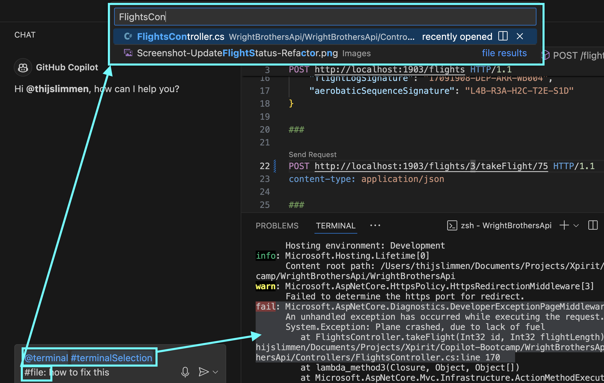
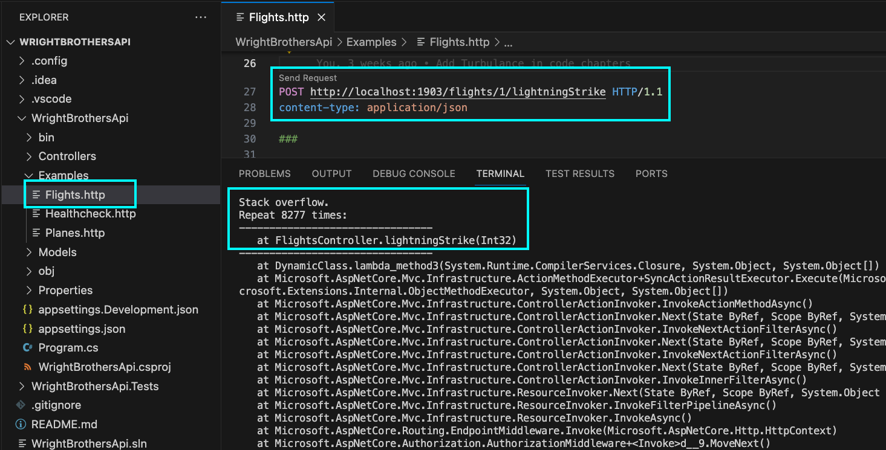
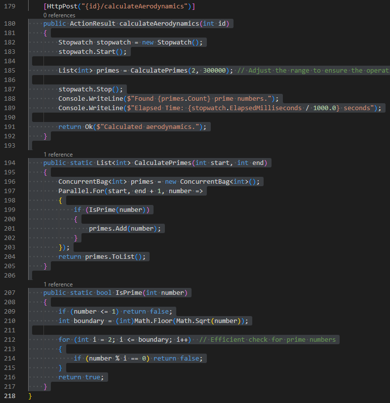

# Lab 4.1 – Aviation Incident Analysis ✈ Troubleshooting with GitHub Copilot

In this lab, you'll investigate simulated aviation incidents using GitHub Copilot to identify and fix root causes in your code. Like an aviation investigator, you’ll analyze failures, ask Copilot for help, and apply human oversight to ensure high-quality results.

A reference to the [Aviation Incident Analysis](<https://en.wikipedia.org/wiki/Mayday_(Canadian_TV_series)>) TV show, where the investigators try to find the root cause of an airplane crash.

**Prerequisites:**  
Complete all prior labs and ensure you have the project set up per the [Labs Prerequisites](../Lab%201.1%20-%20Pre-Flight%20Checklist/README.md).

## Estimated time to complete

- 20 minutes.

## Objective
- Understand Copilot’s strengths and limitations when debugging or fixing issues.

    - Step 1: Flight Crash Investigation – Fuel Depletion Scenario
    - Step 2: Lightning Strikes – Stack Overflow Scenario
    - Step 3: Aerodynamics of an Airplane – Performance Optimization (Optional)
    - Step 4: Aerodynamics of an Airplane – Performance Optimization – Using Agent Mode (Optional)

### Step 1. Flight Crash Investigation - Fuel Depletion Scenario

- Open `FlightsController.cs` file located in the `Controllers` folder.

- Navigate to the `takeFlight` method.

> [!NOTE]
> The method simulates a flight and throws an exception if the flight runs out of fuel.

```csharp
public class FlightsController : ControllerBase
{
    [HttpPost("{id}/takeFlight/{flightLength}")]
    public ActionResult takeFlight(int id, int flightLength)
    {
        var flight = Flights.Find(f => f.Id == id);

        for (int i = 0; i < flightLength; i++)
        {
            if (flight.FuelRange == 0)
            {
                throw new Exception("Plane crashed, due to lack of fuel");
            }
            else
            {
                var fuelConsumption = 1;

                if (flight.FuelTankLeak)
                {
                    fuelConsumption = 2;
                }

                flight.FuelRange -= fuelConsumption;
            }
        }

        return Ok($"Flight took off and flew {flightLength} kilometers/miles.");
    }
}
```

- Open a terminal and navigate to the `WrightBrothersApi` folder

- Run the application

    ```sh
    dotnet run
    ```

> [!NOTE]
> If you encounter an error message like `Project file does not exist.` or `Couldn't find a project to run.`, it's likely that you're executing the command from an incorrect directory. To resolve this, navigate to the correct directory using the command `cd ./WrightBrothersApi`. If you need to move one level up in the directory structure, use the command `cd ..`. The correct directory is the one that contains the `WrightBrothersApi.csproj` file.

- Open the `Examples/Flights.http` file.

- Click `Send Request` to execute the `takeFlight` request.

```
Send Request
POST http://localhost:1903/flights/1/takeFlight/75 HTTP/1.1
content-type: application/json
```

> [!NOTE]
> You must have the `Rest Client` with identifier `humao.rest-client` extension installed in Visual Studio Code to execute the request. Rest Client is a very useful extension to quickly execute HTTP requests and commit them to Git.

> [!NOTE]
> The flight is taking off and the response is `200 OK`. The flight that is simulated did not run out of fuel.

```json
HTTP/1.1 200 OK
Connection: close
```

- Now execute the request again, but now for flight `3`.

- Change the `1` to `3` in the request and execute it again.

```
POST http://localhost:1903/flights/3/takeFlight/75 HTTP/1.1
content-type: application/json
```

- You will see that the flight is taking off and the response is `500 Internal Server Error`. The flight that is simulated ran out of fuel and crashed.

- The Rest Client response will now include the `FlightLog` property as follows:

    ```json
    HTTP/1.1 500 Internal Server Error
    Connection: close

    System.Exception: Plane crashed, due to lack of fuel
    at FlightsController.takeFlight(Int32 id, Int32 flightLength) in C:\Temp\WrightBrothersApi\WrightBrothersApi\Controllers\FlightsController.cs:line 174
    ```

- Stop the app by pressing `Ctrl + C` or `Cmd + C` in the terminal, or by clicking on the 'Stop' button in the debugger panel.

- Now, let's debug it with GitHub Copilot

- Click on the code tab `FlightsController.cs` to bring it into focus.

- Select all the code for method `takeFlight` in `FlightsController.cs`.

- Open **GitHub Copilot Chat**.

- Click `+` to clear prompt history.

- Type the following prompt:

```
How should I fix this exception in the takeFlight method in FlightsController.cs?
```


  
> [!NOTE]
> When asking Copilot for help, provide the necessary context to help it understand the problem. Simply select the problematic code in the editor or mention the filename if you have multiple files open.

- Copilot will suggest a possible fix on how to handle the exception.

- You can go ahead and replace the `takeFlight` method with the new one and run the application again.

- In the Chat window, click on the `Insert at Cursor` button to replace the `takeFlight` method with the new one.

- Run the application

    ```sh
    dotnet run
    ```

- Now go to `Examples/Flights.http` file, click `Send Request` to execute the `takeFlight` request again.

```
POST http://localhost:1903/flights/3/takeFlight/75 HTTP/1.1
content-type: application/json
```

- You will see that the flight is taking off and the response is `409 Conflict`. Plane crashed, due to lack of fuel.

- Stop the app by pressing `Ctrl + C` or `Cmd + C` in the terminal, or by clicking on the 'Stop' button in the debugger panel.

## Step 2. Lightning Strikes, Unexpected Flight Crash - Stack Overflow Scenario

- Open `FlightsController.cs` file located in the `Controllers` folder.

- Navigate to the `lightningStrike` method.

> [!NOTE]
> The method simulates a lightning strike and causes recursion.

```csharp
public class FlightsController : ControllerBase
{
    // Rest of the FlightsController.cs file

    [HttpPost("{id}/lightningStrike")]
    public ActionResult lightningStrike(int id)
    {
        // Lightning caused recursion on an inflight instrument
        lightningStrike(id);

        return Ok($"Recovers from lightning strike.");
    }
}
```

- Open a terminal and navigate to the `WrightBrothersApi` folder

- Run the application

    ```sh
    dotnet run
    ```

> [!NOTE]
> If you encounter an error message like `Project file does not exist.` or `Couldn't find a project to run.`, it's likely that you're executing the command from an incorrect directory. To resolve this, navigate to the correct directory using the command `cd ./WrightBrothersApi`. If you need to move one level up in the directory structure, use the command `cd ..`. The corrcect directory is the one that contains the `WrightBrothersApi.csproj` file.

- Go to the `Examples/Flights.http` file, click `Send Request` to execute the `lightningStrike` request.

    ```
    Send Request
    POST http://localhost:1903/flights/1/lightningStrike HTTP/1.1
    content-type: application/json
    ```

- The application will crash.

    ```json
    Stack overflow.
    at FlightsController.lightningStrike(Int32)
    ```



- Now, let's debug it with GitHub Copilot

- Click on the code tab `FlightsController.cs` to bring it into focus.

- Select all the code for method `lightningStrike` in `FlightsController.cs`.

- Open **GitHub Copilot Chat**.

- Click `+` to clear prompt history.

- Type the following prompt:

```
How should I fix this exception in the lightningStrike method in FlightsController.cs?
```
- Copilot will suggest a possible fix on how to handle the exception.

- You can go ahead and replace the `lightningStrike` method with the new one and run the application again.

- In the Chat window, click on the `Insert at Cursor` button to replace the `lightningStrike` method with the new one.

- Run the application

    ```sh
    dotnet run
    ```

- Now go to `Examples/Flights.http` file, click `Send Request` to execute the `lightningStrike` request again.

    ```
    Send Request
    POST http://localhost:1903/flights/1/lightningStrike HTTP/1.1
    content-type: application/json
    ```

- The application will now recover from the lightning strike.

- Stop the app by pressing `Ctrl + C` or `Cmd + C` in the terminal, or by clicking on the 'Stop' button in the debugger panel.

## Optional

### Step 3. Aerodynamics of an Airplane - Performance Optimization

- Open `FlightsController.cs` file located in the `Controllers` folder.

- Review the `calculateAerodynamics`, 'CaluldatePrimes', and `IsPrime` methods.

> [!NOTE]
> The method is calculating prime numbers.

```csharp
public class FlightsController : ControllerBase
{
    [HttpPost("{id}/calculateAerodynamics")]
    public ActionResult calculateAerodynamics(int id)
    {
        Stopwatch stopwatch = new Stopwatch();
        stopwatch.Start();

        List<int> primes = CalculatePrimes(2, 300000);

        stopwatch.Stop();
        Console.WriteLine($"Found {primes.Count} prime numbers.");
        Console.WriteLine($"Elapsed Time: {stopwatch.ElapsedMilliseconds / 1000.0} seconds");

        return Ok($"Calculated aerodynamics.");
    }

    public static List<int> CalculatePrimes(int start, int end)
    {
        List<int> primes = new List<int>();
        for (int number = start; number <= end; number++)
        {
            if (IsPrime(number))
            {
                primes.Add(number);
            }
        }
        return primes;
    }

    public static bool IsPrime(int number)
    {
        if (number <= 1) return false;
        for (int i = 2; i < number; i++)
        {
            if (number % i == 0) return false;
        }
        return true;
    }
}
```

- Open a terminal and navigate to the `WrightBrothersApi` folder

- Run the application

    ```sh
    dotnet run
    ```

> [!NOTE]
> If you encounter an error message like `Project file does not exist.` or `Couldn't find a project to run.`, it's likely that you're executing the command from an incorrect directory. To resolve this, navigate to the correct directory using the command `cd ./WrightBrothersApi`. If you need to move one level up in the directory structure, use the command `cd ..`. The corrcect directory is the one that contains the `WrightBrothersApi.csproj` file.

- Now go to `Examples/Flights.http` file, click `Send Request` to execute the `calculateAerodynamics` request.

    ```
    Send Request
    POST http://localhost:1903/flights/1/calculateAerodynamics HTTP/1.1
    content-type: application/json
    ```

- Response will be:

    ```json
    HTTP/1.1 200 OK
    Connection: close
    ```

- Terminal will show something like this:

    ```json
    Found 25997 prime numbers.
    Elapsed Time: 4.863 seconds
    ```

- The application will calculate the prime numbers in more than 5 seconds.

- Stop the app by pressing `Ctrl + C` or `Cmd + C` in the terminal, or by clicking on the 'Stop' button in the debugger panel.

- Now, let's use GitHub Copilot to optimize the code.

- Open `FlightsController.cs` and select all the code for the 3 following methods:

    - `calculateAerodynamics` method.
    - `CalculatePrimes` method.
    - `IsPrime` method.

    

- Open **GitHub Copilot Chat**.

- Click `+` to clear prompt history.

- Type the following prompt:

```
What is a more efficient algorithm for finding all prime numbers in a range than checking each number with IsPrime? Please explain how it works.
```

- Read Copilot’s answer. Expect a recommendation for the “Sieve of Eratosthenes” or similar, along with an explanation of how it works.

- Type the following prompt:

    ```
    Can you help me implement the Sieve of Eratosthenes in C#? Please include detailed comments explaining each part. Solve this in a novel way that does not match public code.
    ```

- Copilot will optimize the code.

- Click on the `Apply in Editor` to replace the `calculateAerodynamics` methods with the new one.

- Run the application

    ```sh
    dotnet run
    ```

- Now go to `Examples/Flights.http` file, click `Send Request` to execute the `calculateAerodynamics` request again.

    ```
    Send Request
    POST http://localhost:1903/flights/1/calculateAerodynamics HTTP/1.1
    content-type: application/json
    ```

    Example output

    ```
    Found 25997 prime numbers.
    Elapsed Time: 0.014 seconds
    ```

- The application will now calculate the prime numbers in less than 50 milliseconds.

> [!NOTE]
> GitHub Copilot has knowledge of many algorithmic optimizations and can help you optimize your code performance.

## Optional

### Step 4. Performance Optimization - Using Agent Mode (for advanced users)

- Close the `FlightsController.cs` file.

- Open **GitHub Agent Mode**.

- Click `+` to clear prompt history.

- Type the following prompt:

    ```
    Optimize all recursive methods in FlightsController.cs to include a recursion depth limit and proper error handling.
    ```

**Where to Use Edits or Agent Mode:**  
- **Exception handling and error messaging** (multiple methods)
- **Adding recursion depth checks** (any/all recursive methods)
- **Bulk code optimizations** (multiple calculation or utility methods)

**Agent Mode** could be used to automate all these steps with a single prompt, e.g.,

- Click `+` to clear prompt history.

- Type the following prompt:

```
Scan FlightsController.cs for all crash-prone or inefficient code and generate fixes and performance improvements.
```
- Copilot will optimize the code.

- Click on the `Apply in Editor` to replace the `calculateAerodynamics` methods with the new one.

### Congratulations you've made it to the end! &#9992; &#9992; &#9992;

#### And with that, you've now concluded this module. We hope you enjoyed it! &#x1F60A;
